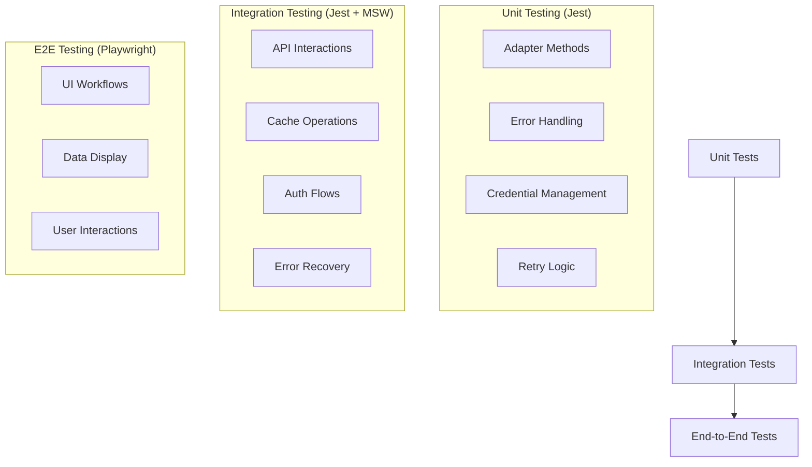

# Integration Framework

The integration framework provides a standardized way to connect with external services. This ensures consistent error handling, data transformation, caching, and authentication across all integrations.

## Core Components

- **BaseAdapter**: Abstract base class defining the standard interface for all service adapters
- **IntegrationManager**: Central coordinator for all adapters, credentials, and sync jobs
- **RetryStrategy**: Implements exponential backoff with jitter for resilient API operations
- **CredentialsManager**: Secure storage and retrieval of service credentials
- **SyncJob**: Background job processor for data synchronization
- **IntegrationError**: Standardized error handling for all integration operations

## Testing Strategy

The integration framework implements a multi-layered testing approach to ensure robustness and reliability:



### Unit Testing

Unit tests focus on the behavior of individual components:

1. **BaseAdapter Tests**
   - Test error categorization and handling
   - Verify retry determination logic
   - Test credential validation

2. **RetryStrategy Tests**
   - Verify exponential backoff algorithm
   - Test proper handling of retryable/non-retryable errors
   - Check timeout and maximum retry limits

3. **IntegrationManager Tests**
   - Test adapter registration and retrieval
   - Verify singleton pattern implementation
   - Test credential management
   - Verify job management

### Integration Testing

Integration tests verify the interaction between components:

1. **Mock Service Testing**
   - Test adapters against mock services
   - Verify proper caching behavior
   - Test synchronization jobs
   - Validate error handling

2. **Authentication Flows**
   - Test OAuth flows
   - Verify token refresh
   - Test recovery from authentication failures

### End-to-End Testing

E2E tests verify the entire user experience:

1. **UI Integration Tests**
   - Test data display in React components
   - Verify error states and loading indicators
   - Test form submission workflows

### Test Directory Structure

```
/frontend
  /tests
    /unit
      /integrations
        /core
          baseadapter.test.ts
          integrationmanager.test.ts
          retrylogic.test.ts
          credentialsmanager.test.ts
        /adapters
          current-rms.test.ts
          google-workspace.test.ts
    /integration
      /integrations
        current-rms-integration.test.ts
        google-workspace-integration.test.ts
    /e2e
      integration-flows.spec.ts
    /mocks
      /services
        current-rms-mock.ts
        google-workspace-mock.ts
      /fixtures
        equipment-data.json
        rental-data.json
```

## Implementation Plan

### Phase 1: Core Unit Tests

- [x] Create base adapter tests
- [x] Implement retry strategy tests
- [x] Develop integration manager tests
- [ ] Add credentials manager tests

### Phase 2: Service-Specific Adapter Tests

- [ ] Current RMS adapter tests
- [ ] Google Workspace adapter tests
- [ ] DocuSign adapter tests

### Phase 3: Integration Tests

- [ ] Mock service implementation
- [ ] Integration test for Current RMS
- [ ] Integration test for Google Workspace

### Phase 4: E2E Tests

- [ ] Rental management workflows
- [ ] Document management workflows

## Running Tests

Run all tests:
```bash
npm run test
```

Run specific test category:
```bash
npm run test:unit
npm run test:integration
npm run test:e2e
```

## Best Practices

1. **Use Mock Implementations**: Create mock implementations of adapters and services to isolate tests.
2. **Test Error Handling**: Ensure all error cases are properly tested.
3. **Test Retries and Timeouts**: Verify retry behavior with different error types.
4. **Validate Authentication**: Test all authentication scenarios.
5. **Test Caching Logic**: Verify that caching works correctly.
