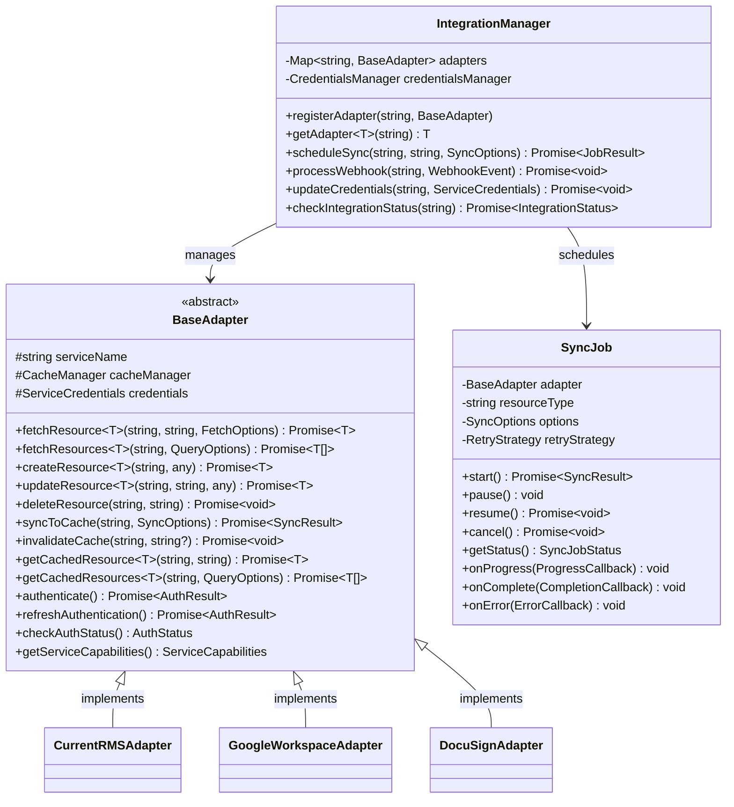
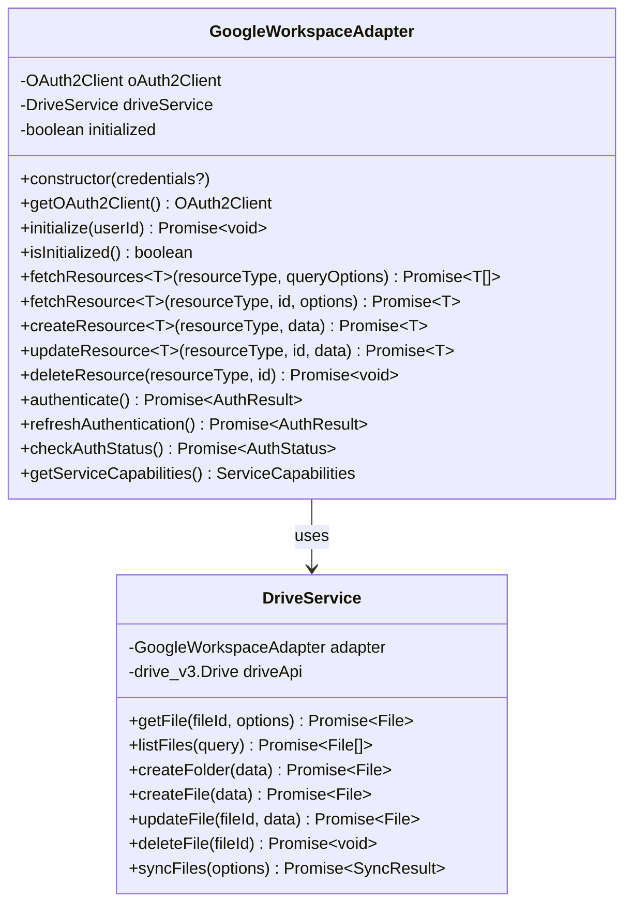
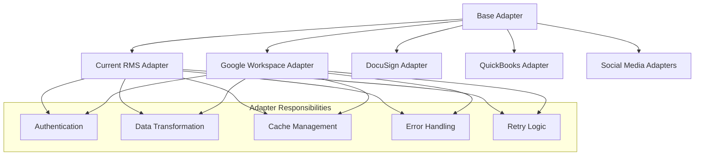
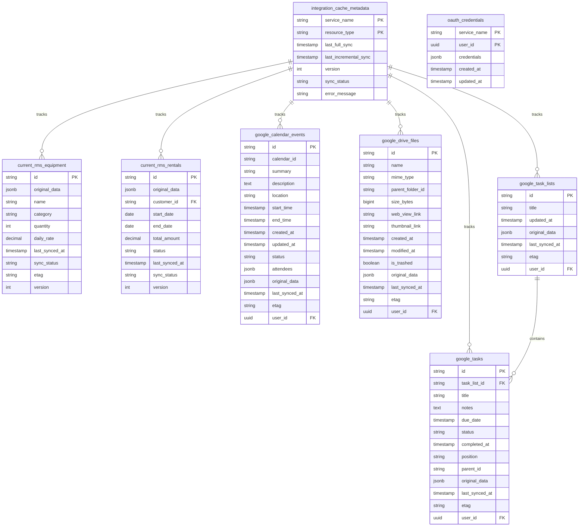

# Architecture Details

**File Purpose**: Archive detailed information about system architecture that's referenced from core files  
**Related Files**: [systemPatterns.md](../systemPatterns.md), [techContext.md](../techContext.md)  
**Navigation**: For complete memory bank navigation, see [index.md](../index.md)

## Core Integration Components

### Integration Manager

The central coordination service responsible for managing all integration adapters, authentication, and synchronization:



### Google Workspace Adapter Architecture

The Google Workspace adapter has been simplified to focus on Drive functionality:



### Service-Specific Adapters

Each external service has its own adapter implementation that extends the base adapter:



### Cache Tables Structure

Supabase tables serve as a cache layer for external data with a consistent schema pattern:



### Google Workspace Integration Architecture

```mermaid
flowchart TD
    User[User] -->|Connect Account| OAuth[OAuth Flow]
    OAuth -->|Store Tokens| CredStore[Credential Storage]
    
    UI[Employee Dashboard] -->|View Calendar| CalendarComp[Calendar Component with Placeholder]
    UI -->|View Drive| DriveComp[Drive Component]
    UI -->|View Tasks| TasksComp[Task Component with Placeholder]
    
    CalendarComp -->|API Request| CalendarRoute[/api/calendar]
    DriveComp -->|API Request| DriveRoute[/api/drive]
    TasksComp -->|API Request| TasksRoute[/api/tasks]
    
    CalendarRoute -->|503 Response| UnavailableMsg[Service Unavailable Message]
    DriveRoute --> GWAdapter[Google Workspace Adapter]
    TasksRoute -->|503 Response| UnavailableMsg
    
    GWAdapter -->|Fetch/Cache| DriveSvc[Drive Service]
    
    DriveSvc -->|API Calls| GoogleAPI[Google APIs]
    
    DriveSvc -->|Cache| DriveDB[Drive Cache]
    
    CredStore -->|Provide Tokens| GWAdapter
```

### Project Structure

The integration code is organized in a modular structure to maximize maintainability:

```
/frontend
  /lib
    /integrations
      /core                # Core framework
      /adapters            # Service-specific adapters
        /current-rms
        /google-workspace
          /index.ts        # Main adapter
          /auth.ts         # Authentication utilities
          /services        # Service-specific implementations
            /calendar.ts
            /drive.ts
            /tasks.ts
        /docusign
        /quickbooks
      /cache               # Cache utilities
      /auth                # Auth utilities
      /utils               # Shared utilities
  /app
    /api
      /integrations        # API routes
        /google-workspace
          /auth            # Authentication routes
          /calendar        # Calendar API routes (returns 503)
          /drive           # Drive API routes
          /tasks           # Tasks API routes (returns 503)
      /webhooks            # Webhook endpoints
```

## Data Synchronization Architecture

```mermaid
flowchart TD
    Initial[Initial Load] --> Scheduled[Scheduled Refresh]
    Scheduled --> Webhook[Webhook Updates]
    Webhook --> ActionBased[Action-Based Refresh]
    
    subgraph "Invalidation Strategies"
        Time[Time-Based]
        Version[Version-Based]
        Action[Action-Based]
        Dependency[Dependency-Based]
    end
