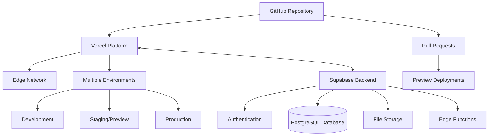

# Hosting & Deployment Strategy

## Overview

Front of House Productions web application uses Vercel for hosting and deployment. This document outlines the hosting architecture, deployment workflow, and integration with Supabase for backend services.

## Hosting Architecture

## Vercel Configuration

The project has been configured on Vercel with the following settings:

- **Project Name**: frontend
- **Framework Preset**: Next.js
- **Build Command**: next build
- **Development Command**: next dev --port $PORT
- **Output Directory**: Next.js default

A `vercel.json` configuration file has been added to the project with:

- Environment variables placeholders for Supabase
- Build configuration
- GitHub integration settings

## Environment Setup

### Development Environment

- Local development server using `npm run dev`
- Connect to Supabase for backend services
- Environment variables stored in `.env.local` (not committed to git)

### Preview Environment

- Automatically deployed for each pull request
- Isolated environment for testing changes
- Temporary URL for sharing and reviewing

### Production Environment

- Deployed from the main branch
- Custom domain setup (pending)
- Production-grade infrastructure

## Deployment Workflow

1. Developers push changes to feature branches
2. Pull requests trigger preview deployments
3. Code review and testing on preview deployments
4. Merged PRs to main branch deploy to production
5. Vercel handles build, optimization, and deployment

## Supabase Integration

The application uses Supabase for backend services:

- **Database**: PostgreSQL for structured data storage
- **Authentication**: User authentication and authorization
- **Storage**: File storage for documents, images, etc.
- **Edge Functions**: Serverless functions for backend logic

A detailed Supabase setup guide has been created at `frontend/supabase-setup.md`.

## Environment Variables

The following environment variables are required:

- `NEXT_PUBLIC_SUPABASE_URL`: Supabase project URL
- `NEXT_PUBLIC_SUPABASE_ANON_KEY`: Supabase anonymous key

These can be set through the Vercel dashboard or using the Vercel CLI.

## Monitoring & Analytics

- Vercel Analytics for performance monitoring
- Error tracking through Vercel
- Custom analytics to be implemented

## Next Steps

1. Complete Supabase project setup
2. Configure environment variables in Vercel
3. Set up custom domain
4. Implement CI/CD pipeline
5. Configure Supabase RLS policies
