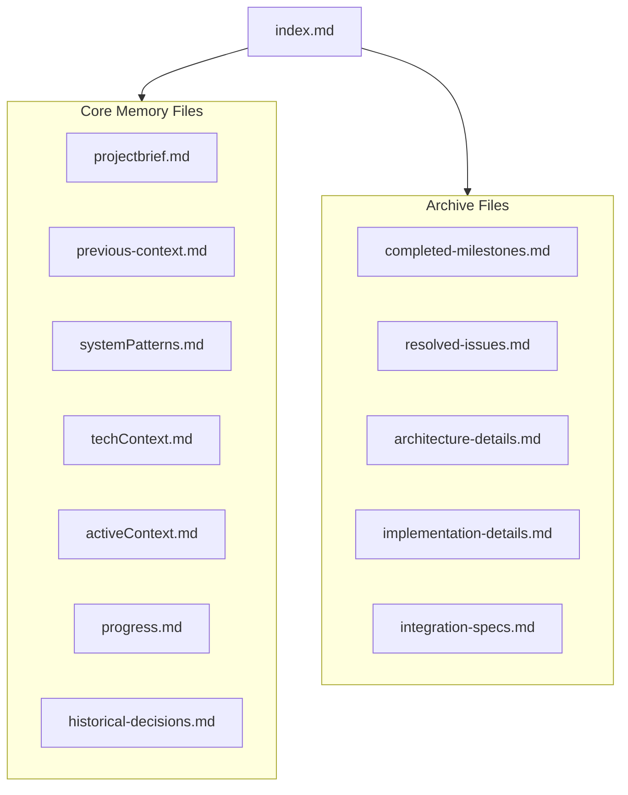

# Memory Bank Index

*Last Updated: March 17, 2025*

This index serves as the central navigation point for all memory bank files. Use this document to quickly locate information across the memory bank system.

## Memory Bank Structure

## Core Memory Files

| File | Purpose | Key Information |
|------|---------|----------------|
| **projectbrief.md** | Foundation document defining core requirements | Project overview, core features, target users, technical preferences |
| **productContext.md** | Why the project exists and what problems it solves | Purpose & vision, problems solved, user experience goals, key interactions & flows |
| **systemPatterns.md** | System architecture and patterns | Architecture overview, design patterns, component relationships, integration architecture |
| **techContext.md** | Technologies used and development details | Tech stack, development setup, technical constraints, dependencies list, external integrations |
| **activeContext.md** | Current focus and recent developments | Current focus, recent changes, next steps, active decisions & considerations |
| **progress.md** | Project status and what's left to build | Current status, in-progress items, remaining tasks, current issues, upcoming milestones |
| **hosting-deployment.md** | Hosting configuration and deployment procedures | Vercel setup, deployment workflow, environment variables |

## Archive Files

| File | Purpose | Related Core Files |
|------|---------|-------------------|
| **archive/previous-context.md** | Historical context from earlier phases | activeContext.md |
| **archive/completed-milestones.md** | Completed project achievements | progress.md |
| **archive/resolved-issues.md** | Previously fixed issues | progress.md |
| **archive/historical-decisions.md** | Past decisions on architecture/features | systemPatterns.md, activeContext.md |
| **archive/architecture-details.md** | Detailed architecture specifications | systemPatterns.md |
| **archive/implementation-details.md** | Code-level implementation notes | systemPatterns.md, techContext.md |
| **archive/integration-specs.md** | Detailed integration specifications | systemPatterns.md, techContext.md |

## Topic-to-File Mapping

Need information about a specific topic? Use this guide to locate it quickly:

| Topic | Primary File | Secondary Files | Archive Files |
|-------|-------------|----------------|---------------|
| **Project Overview** | projectbrief.md | productContext.md | - |
| **User Experience** | productContext.md | activeContext.md | - |
| **Architecture** | systemPatterns.md | techContext.md | architecture-details.md |
| **Tech Stack** | techContext.md | .clinerules | - |
| **Dependencies** | techContext.md | - | - |
| **Current Focus** | activeContext.md | progress.md | - |
| **Integration** | systemPatterns.md | techContext.md | integration-specs.md |
| **Authentication** | systemPatterns.md | activeContext.md | - |
| **Security** | systemPatterns.md | .clinerules | - |
| **Testing** | techContext.md | .clinerules | - |
| **Deployment** | hosting-deployment.md | techContext.md | - |

## Project Intelligence (.clinerules)

The `.clinerules` file captures important patterns, preferences, and project intelligence. It includes:

- Project configuration
- Tech stack overview
- Project structure
- Database migration protocols
- Development workflow
- Security guidelines
- Technical learnings:
  - Next.js module system
  - Windows/PowerShell environment
  - Integration framework patterns
  - Testing strategy
  - Role-based security model

## Memory Bank Maintenance

### When to Update

1. **After Implementing Changes**: Update relevant files to reflect new functionality or changes
2. **When Discovering New Patterns**: Document in `.clinerules`
3. **After Resolving Issues**: Document solutions in core files, later move to archive
4. **When Requested with "update memory bank"**: Review ALL files for accuracy

### What Goes Where

- **Core Files**: Current and active information
- **Archive Files**: Historical context, resolved issues, completed work
- **.clinerules**: Technical patterns, workflow preferences, environment quirks
- **index.md (this file)**: Update when file structure changes or topics shift

### Archive Process

When information becomes historical:
1. Identify content for archiving (completed work, resolved issues, etc.)
2. Move to appropriate archive file
3. Update cross-references in core files
4. Update this index if needed

## Search Keywords

Integration, adapter pattern, portal, authentication, RLS, caching, Supabase, Next.js, Tailwind CSS, module system, testing, role-based security, frontend, responsive, deployment, Vercel, API, TypeScript
