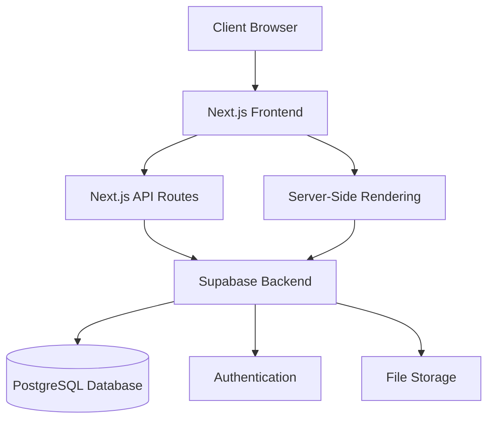
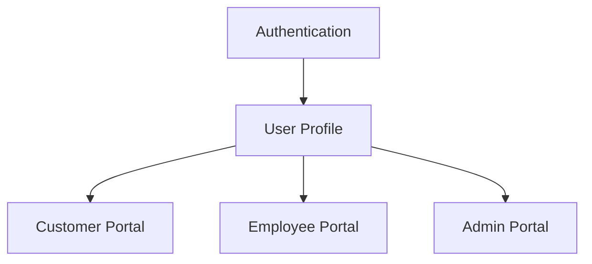
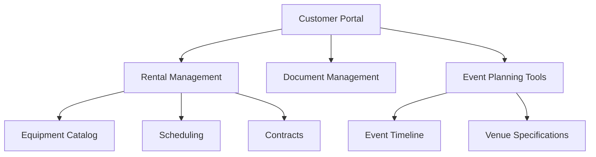
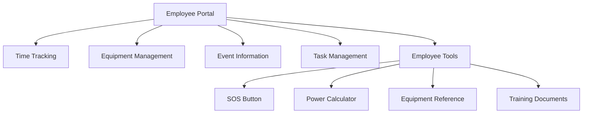

# System Patterns

## Architecture Overview

The Front of House Productions (FOHP) web application follows a modern web application architecture with clear separation of concerns:

## Key Technical Decisions

### Frontend Architecture
- **App Router Pattern**: Using Next.js 14+ App Router for file-based routing and React Server Components
- **Component-Based Design**: Building UI from reusable components with clear responsibilities
- **Responsive Design**: Mobile-first approach using Tailwind CSS for all styling
- **State Management**: Using React Context API for global state and React Query for server state management
- **Progressive Enhancement**: Core functionality works without JavaScript, enhanced with client-side interactions

### Backend Architecture
- **API-First Design**: Well-defined API endpoints for all data operations
- **Supabase Integration**: Leveraging Supabase for authentication, database, and storage needs
- **Server-Side Rendering**: Using Next.js SSR for improved performance and SEO
- **Edge Deployment**: Deploying to Vercel's edge network for optimal performance

### Database Design
- **Relational Model**: PostgreSQL database with well-defined relationships
- **Role-Based Access**: Implementing row-level security in Supabase
- **Migration-Based Changes**: Using versioned migrations for all schema changes

## Design Patterns

### Frontend Patterns
- **Compound Components**: For complex UI elements with shared state
- **Render Props**: For reusable component logic
- **Custom Hooks**: For shared stateful logic across components
- **Container/Presentation**: Separating data fetching from rendering
- **Feature-Based Organization**: Components organized by feature rather than type

### Backend Patterns
- **Repository Pattern**: Abstracting database operations
- **Service Layer**: Business logic separated from data access
- **Middleware**: For request processing, authentication, and error handling
- **Event-Driven**: Using webhooks and pub/sub for integrations

## Component Relationships

### User Management

### Customer Flow

### Employee Flow

## Security Model

- **Authentication**: JWT-based auth through Supabase
- **Authorization**: Role-based access control with specific permissions
- **Data Protection**: Row-level security in PostgreSQL
- **API Security**: Rate limiting, CORS, and input validation

## Integration Approach

- **Google Workspace**: API integration for calendars, docs, and contacts
- **Inventory Management**: API or webhook integration with existing systems
- **Push Notifications**: Web Push API for browser notifications
- **Maps**: Google Maps API integration for location services
