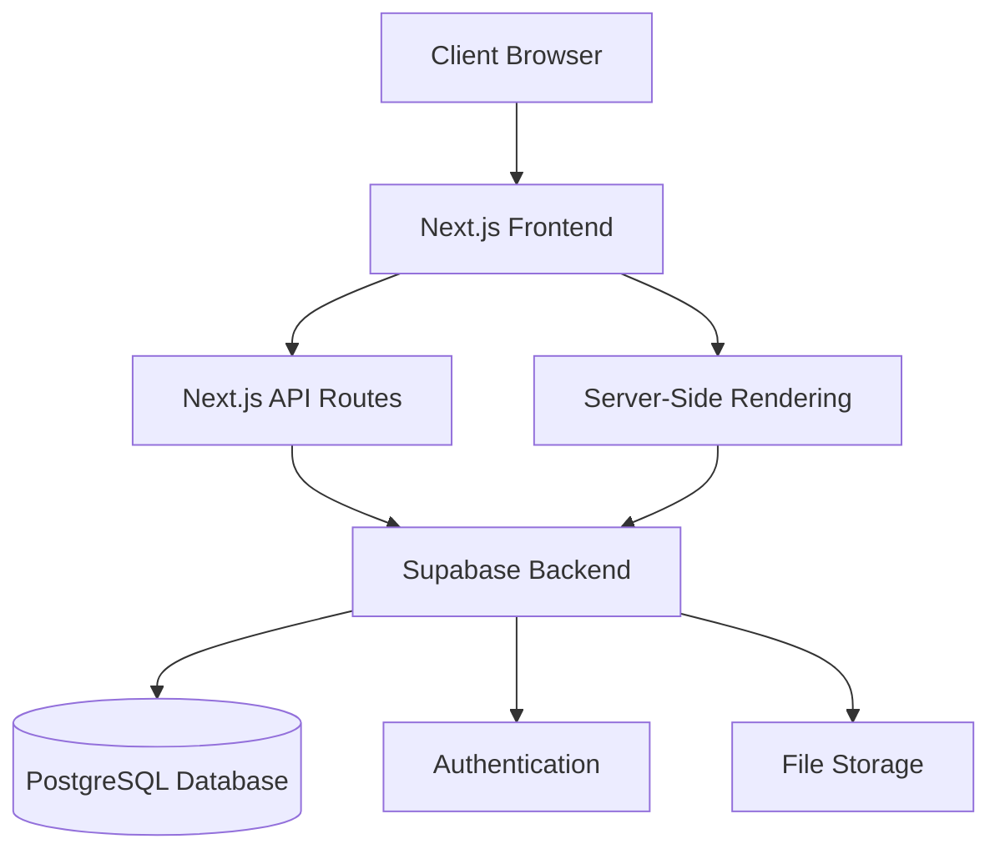
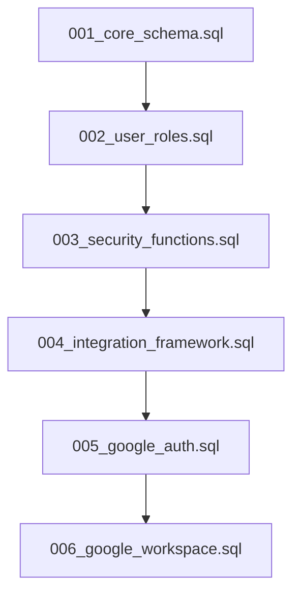
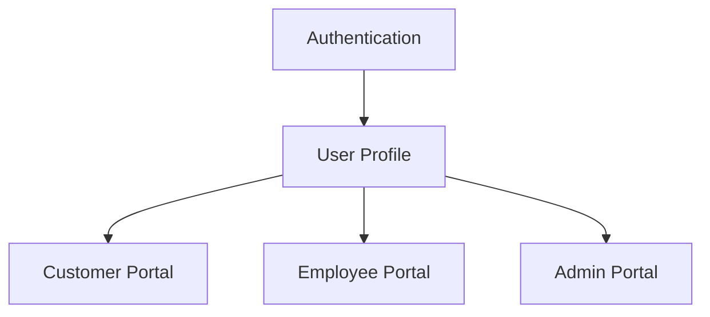
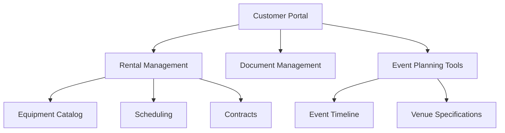
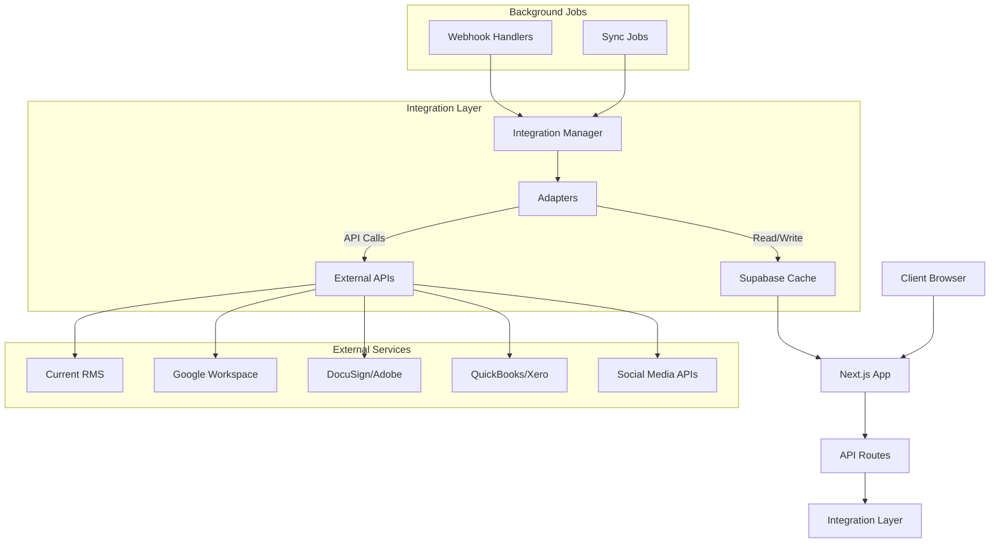

# System Patterns

**File Purpose**: Document system architecture, design patterns, and component relationships  
**Related Files**: [techContext.md](techContext.md), [activeContext.md](activeContext.md)  
**Archive References**: [architecture-details.md](archive/architecture-details.md), [implementation-details.md](archive/implementation-details.md)  
**Navigation**: For complete memory bank navigation, see [index.md](index.md)

## Architecture Overview

The Front of House Productions (FOHP) web application follows a modern web application architecture with clear separation of concerns:



## Key Technical Decisions

### Frontend Architecture
- **App Router Pattern**: Using Next.js 14+ App Router for file-based routing and React Server Components
- **Component-Based Design**: Building UI from reusable components with clear responsibilities
- **Responsive Design**: Mobile-first approach using Tailwind CSS for all styling
- **State Management**: Using React Context API for global state and React Query for server state management
- **Progressive Enhancement**: Core functionality works without JavaScript, enhanced with client-side interactions

### Backend Architecture
- **API-First Design**: Well-defined API endpoints for all data operations
- **Supabase Integration**: Leveraging Supabase for authentication, database, and storage needs
- **Server-Side Rendering**: Using Next.js SSR for improved performance and SEO
- **Edge Deployment**: Deploying to Vercel's edge network for optimal performance
- **Logical Migration Strategy**: Using consolidated, domain-specific migrations instead of incremental patches

### Database Design
- **Relational Model**: PostgreSQL database with well-defined relationships
- **Role-Based Access**: Implementing row-level security in Supabase
- **Consolidated Migration Structure**: Using logical component grouping for improved maintainability

### Database Migration Strategy

We've moved from incremental migration files to a consolidated, logical structure:



Each consolidated migration file serves a specific purpose:

1. **001_core_schema.sql**: Core tables (profiles, equipment, rentals, documents) with basic RLS
2. **002_user_roles.sql**: User role management system and profile synchronization
3. **003_security_functions.sql**: Security definer functions for role-based permissions
4. **004_integration_framework.sql**: Integration cache schema and credential storage
5. **005_google_auth.sql**: Google authentication with robust error handling
6. **006_google_workspace.sql**: Google Workspace integration with user-specific caching

Key benefits of this approach:
- **Reduced complexity**: Each file focuses on a specific domain
- **Improved maintainability**: Clear structure makes changes easier to implement
- **Better documentation**: Each file includes detailed comments and section headers
- **Enhanced security**: Explicit SECURITY DEFINER functions with search_path set
- **Optimized performance**: Strategic indexing for commonly queried columns
- **Robust error handling**: Comprehensive error handling in all functions

## Design Patterns

### Frontend Patterns
- **Compound Components**: For complex UI elements with shared state
- **Render Props**: For reusable component logic
- **Custom Hooks**: For shared stateful logic across components
- **Container/Presentation**: Separating data fetching from rendering
- **Feature-Based Organization**: Components organized by feature rather than type

### Backend Patterns
- **Repository Pattern**: Abstracting database operations
- **Service Layer**: Business logic separated from data access
- **Middleware**: For request processing, authentication, and error handling
- **Event-Driven**: Using webhooks and pub/sub for integrations
- **Consolidated Migrations**: Organizing database changes by logical domain rather than chronologically

## Component Relationships

### User Management


### Customer Flow


### Employee Flow
```mermaid
flowchart TD
    EmployeePortal[Employee Portal] --> TimeTracking[Time Tracking]
    EmployeePortal --> EquipmentMgmt[Equipment Management]
    EmployeePortal --> EventInfo[Event Information]
    EmployeePortal --> Tasks[Task Management]
    EmployeePortal --> Tools[Employee Tools]
    EmployeePortal --> Google[Google Workspace]
    
    Google --> Drive[Drive]
    Google --> Calendar[Calendar "Coming Soon"]
    Google --> GTasks[Tasks "Coming Soon"]
    
    Tools --> SOS[SOS Button]
    Tools --> Calculator[Power Calculator]
    Tools --> Reference[Equipment Reference]
    Tools --> Training[Training Documents]
```

## Security Model

- **Authentication**: JWT-based auth through Supabase
- **Authorization**: Role-based access control with specific permissions
- **Data Protection**: Row-level security in PostgreSQL
- **API Security**: Rate limiting, CORS, and input validation
- **Security Context**: Explicit SECURITY DEFINER functions with search_path set for all role-based operations

## Integration Architecture

The application implements a sophisticated integration strategy to connect with various external systems and services while maintaining performance, security, and a consistent development approach.

### Universal Integration Architecture



### Integration Core Components

- **Integration Manager**: Central coordination service for all external service adapters
- **BaseAdapter**: Abstract interface defining consistent pattern for all service integrations
- **Service-Specific Adapters**: Custom implementations for each external service
- **Caching Layer**: Database tables as cache for external service data
- **Synchronization**: Multiple syncing strategies based on data requirements
- **Error Handling**: Consistent error handling with retry strategies

> For detailed implementation of integration components, see [implementation-details.md](archive/implementation-details.md)

> For detailed architecture diagrams and component relationships, see [architecture-details.md](archive/architecture-details.md)

### Core Principles of External Integrations

1. **Unified Interface**: All external services accessed through consistent adapter pattern
2. **Resilient Operations**: Comprehensive error handling and retry mechanisms
3. **Local Caching**: External data cached in database tables for performance and reliability
4. **User-Specific Data**: Authentication credentials and data specific to each user
5. **Flexible Synchronization**: Multiple sync strategies based on data needs
6. **Security Focus**: Secure credential storage and proper access control

### Google Workspace Integration

Our primary integration is with Google Workspace, currently with:

- **Google Drive**: ✅ Fully implemented with file browsing capabilities
- **Google Calendar**: ⚠️ Temporarily simplified with placeholder UI
- **Google Tasks**: ⚠️ Temporarily simplified with placeholder UI

> Detailed implementation and service-specific approaches are documented in [implementation-details.md](archive/implementation-details.md)
