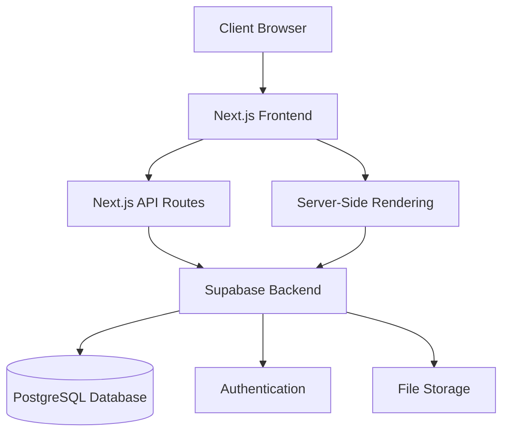
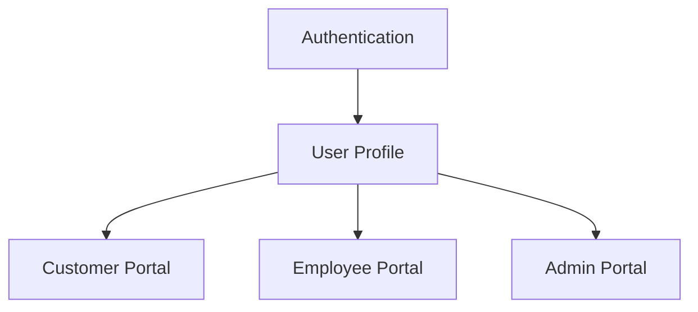
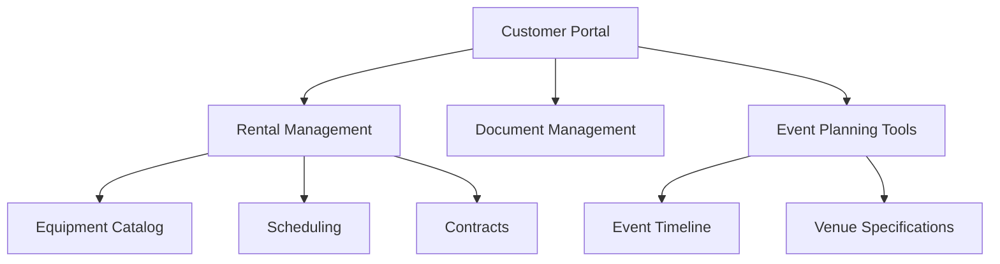
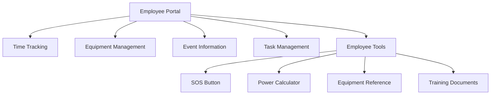
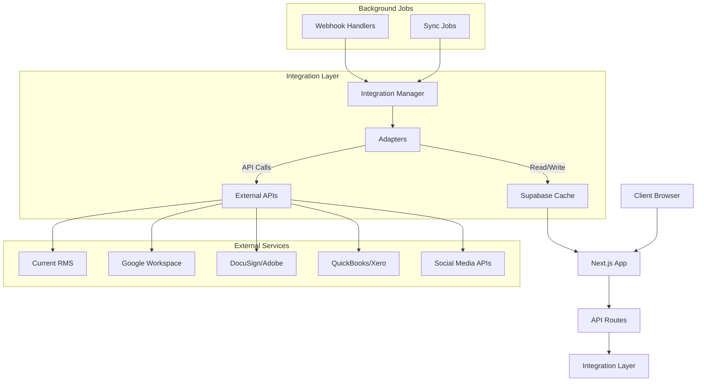
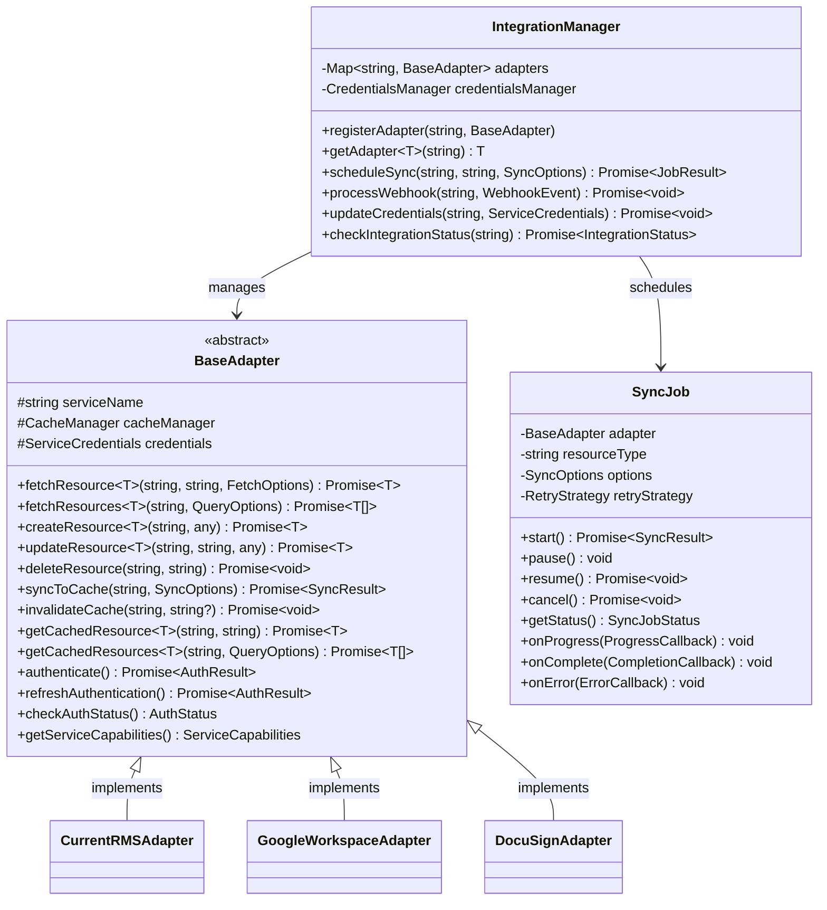
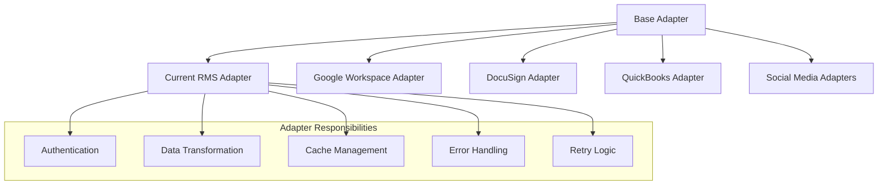
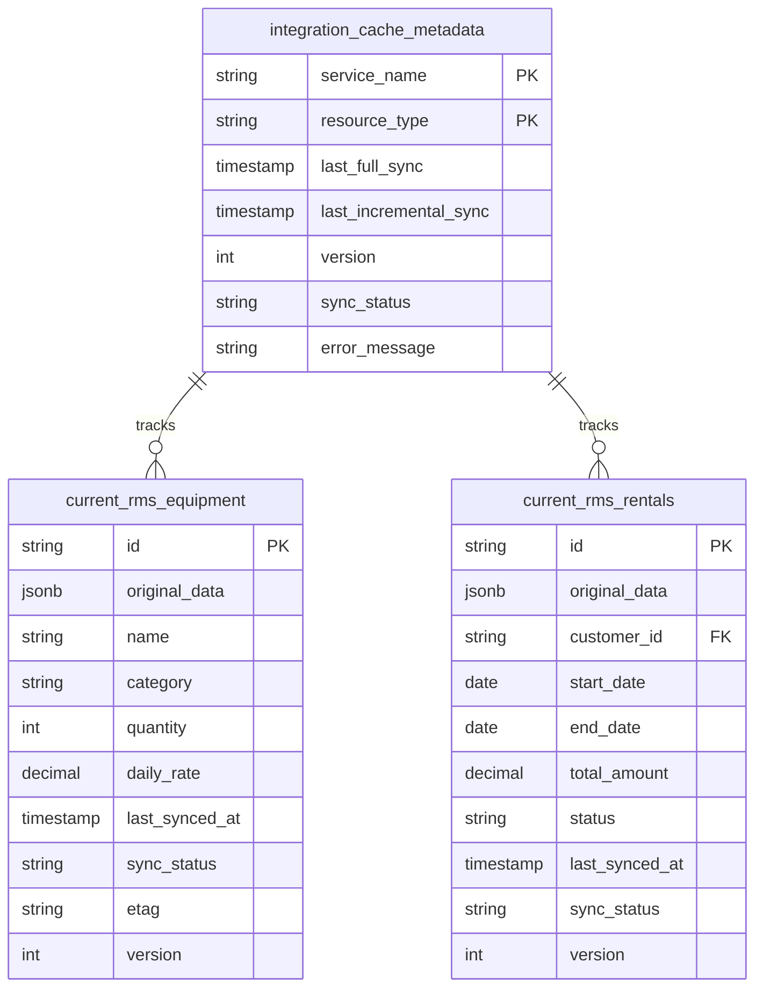
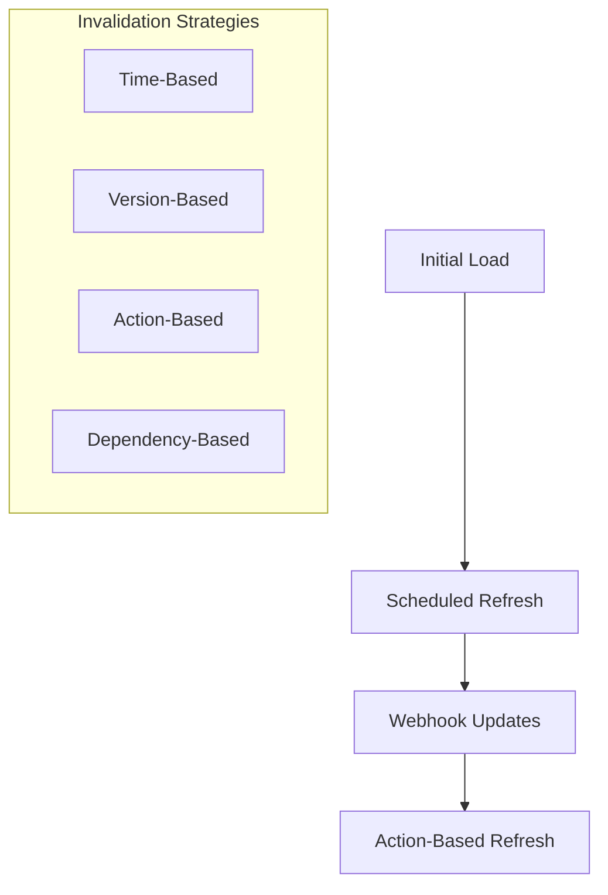

# System Patterns

**File Purpose**: Document system architecture, design patterns, and component relationships  
**Related Files**: [techContext.md](techContext.md), [activeContext.md](activeContext.md)  
**Archive References**: [architecture-details.md](archive/architecture-details.md), [implementation-details.md](archive/implementation-details.md)  
**Navigation**: For complete memory bank navigation, see [index.md](index.md)

## Architecture Overview

The Front of House Productions (FOHP) web application follows a modern web application architecture with clear separation of concerns:



## Key Technical Decisions

### Frontend Architecture
- **App Router Pattern**: Using Next.js 14+ App Router for file-based routing and React Server Components
- **Component-Based Design**: Building UI from reusable components with clear responsibilities
- **Responsive Design**: Mobile-first approach using Tailwind CSS for all styling
- **State Management**: Using React Context API for global state and React Query for server state management
- **Progressive Enhancement**: Core functionality works without JavaScript, enhanced with client-side interactions

### Backend Architecture
- **API-First Design**: Well-defined API endpoints for all data operations
- **Supabase Integration**: Leveraging Supabase for authentication, database, and storage needs
- **Server-Side Rendering**: Using Next.js SSR for improved performance and SEO
- **Edge Deployment**: Deploying to Vercel's edge network for optimal performance

### Database Design
- **Relational Model**: PostgreSQL database with well-defined relationships
- **Role-Based Access**: Implementing row-level security in Supabase
- **Migration-Based Changes**: Using versioned migrations for all schema changes

## Design Patterns

### Frontend Patterns
- **Compound Components**: For complex UI elements with shared state
- **Render Props**: For reusable component logic
- **Custom Hooks**: For shared stateful logic across components
- **Container/Presentation**: Separating data fetching from rendering
- **Feature-Based Organization**: Components organized by feature rather than type

### Backend Patterns
- **Repository Pattern**: Abstracting database operations
- **Service Layer**: Business logic separated from data access
- **Middleware**: For request processing, authentication, and error handling
- **Event-Driven**: Using webhooks and pub/sub for integrations

## Component Relationships

### User Management


### Customer Flow


### Employee Flow


## Security Model

- **Authentication**: JWT-based auth through Supabase
- **Authorization**: Role-based access control with specific permissions
- **Data Protection**: Row-level security in PostgreSQL
- **API Security**: Rate limiting, CORS, and input validation

## Integration Architecture

The application implements a sophisticated integration strategy to connect with various external systems and services while maintaining performance, security, and a consistent development approach.

### Universal Integration Architecture



### Core Integration Components

#### Integration Manager

The central coordination service responsible for managing all integration adapters, authentication, and synchronization:



#### Service-Specific Adapters

Each external service has its own adapter implementation that extends the base adapter:



#### Cache Tables Structure

Supabase tables serve as a cache layer for external data with a consistent schema pattern:



### Core Integration Components Implementation

The core integration components have been implemented with the following structure:

#### Integration Manager Implementation 

```typescript
export class IntegrationManager {
  private static instance: IntegrationManager;
  private adapters: Map<string, BaseAdapter> = new Map();
  private credentialsManager: CredentialsManager;
  private activeJobs: Map<string, SyncJob> = new Map();
  
  // Singleton pattern implementation
  public static getInstance(): IntegrationManager {
    if (!IntegrationManager.instance) {
      IntegrationManager.instance = new IntegrationManager();
    }
    return IntegrationManager.instance;
  }
  
  // Adapter registration and retrieval
  public registerAdapter(adapter: BaseAdapter): void {...}
  public getAdapter<T extends BaseAdapter>(serviceName: string): T {...}
  
  // Credential management
  public async updateCredentials(serviceName: string, credentials: ServiceCredentials): Promise<void> {...}
  
  // Sync job scheduling
  public async scheduleSync(serviceName: string, resourceType: string, options?: SyncOptions): Promise<JobResult> {...}
  
  // Authentication handling
  public async handleOAuthCallback(serviceName: string, code: string, ...): Promise<ServiceCredentials> {...}
  
  // Webhook processing
  public async processWebhook(serviceName: string, event: {...}): Promise<void> {...}
}
```

#### Base Adapter Implementation

```typescript
export abstract class BaseAdapter {
  protected serviceName: string;
  protected credentials?: ServiceCredentials;
  
  // CRUD operations
  abstract fetchResource<T>(resourceType: string, id: string, options?: FetchOptions): Promise<T>;
  abstract fetchResources<T>(resourceType: string, query: QueryOptions): Promise<T[]>;
  abstract createResource<T>(resourceType: string, data: any): Promise<T>;
  abstract updateResource<T>(resourceType: string, id: string, data: any): Promise<T>;
  abstract deleteResource(resourceType: string, id: string): Promise<void>;
  
  // Cache operations
  abstract syncToCache(resourceType: string, options?: SyncOptions): Promise<SyncResult>;
  abstract invalidateCache(resourceType: string, id?: string): Promise<void>;
  abstract getCachedResource<T>(resourceType: string, id: string): Promise<T>;
  abstract getCachedResources<T>(resourceType: string, query: QueryOptions): Promise<T[]>;
  
  // Authentication
  abstract authenticate(): Promise<AuthResult>;
  abstract refreshAuthentication(): Promise<AuthResult>;
  abstract checkAuthStatus(): Promise<AuthStatus>;
  
  // Error handling
  protected createError(error: any, operation: string): IntegrationError {...}
  protected categorizeError(error: any): IntegrationErrorType {...}
  protected isRetryable(errorType: IntegrationErrorType, error: any): boolean {...}
}
```

#### Sync Job Implementation

```typescript
export class SyncJob {
  private jobId: string;
  private adapter: BaseAdapter;
  private resourceType: string;
  private options: SyncOptions;
  private retryStrategy: RetryStrategy;
  private status: 'pending' | 'running' | 'paused' | 'completed' | 'failed' = 'pending';
  
  // Job control methods
  async start(): Promise<SyncResult> {...}
  pause(): void {...}
  async resume(): Promise<SyncResult> {...}
  cancel(): void {...}
  
  // Event handling
  onProgress(callback: ProgressCallback): SyncJob {...}
  onComplete(callback: CompletionCallback): SyncJob {...}
  onError(callback: ErrorCallback): SyncJob {...}
}
```

#### Retry Logic Implementation

```typescript
export class RetryStrategy {
  private maxAttempts: number;
  private baseDelay: number;
  private maxDelay: number;
  private factor: number;
  
  // Retry execution
  async execute<T>(fn: () => Promise<T>): Promise<T> {...}
  
  // Function decorator for retryable operations
  retryable<T, Args extends any[]>(fn: (...args: Args) => Promise<T>): (...args: Args) => Promise<T> {...}
}
```

#### Credentials Manager Implementation

```typescript
export class CredentialsManager {
  private static instance: CredentialsManager;
  private cache: Map<string, ServiceCredentials> = new Map();
  
  // Credential operations
  async storeCredentials(serviceName: string, credentials: ServiceCredentials): Promise<void> {...}
  async getCredentials(serviceName: string): Promise<ServiceCredentials> {...}
  async hasValidCredentials(serviceName: string): Promise<boolean> {...}
  async refreshOAuthToken(serviceName: string): Promise<ServiceCredentials> {...}
  
  // Security methods
  private encrypt(data: string): string {...}
  private decrypt(data: string): string {...}
}
```

#### Database Schema Implementation

The database schema has been implemented in Supabase with the following tables:

1. **integration_credentials** - Securely stores API credentials
2. **integration_cache.metadata** - Tracks synchronization status
3. **integration_cache.current_rms_equipment** - Example cache table for Current RMS

The schema includes proper RLS policies:
- Credentials accessible only by service role
- Cache tables viewable by authenticated users

### Integration Approach By Service Category

#### Business Operations
- **Current RMS**: RESTful API integration with caching for customer data, inventory, and rental tracking
  - Caching approach: Full catalog sync weekly, incremental sync daily, real-time sync for bookings
  - Implementation priority: First priority, focusing on equipment and rental data
- **QuickBooks/Xero**: API integration for invoice management and financial data
  - Caching approach: Daily sync for invoices, real-time for payment status
  - Implementation priority: Medium-term, after core rental features

#### Google Workspace Ecosystem
- **Google Calendar**: CalDAV/API integration for event scheduling and timeline management
  - Caching approach: Hourly sync for upcoming events, webhook updates when possible
- **Google Drive**: API integration for document storage and management
  - Caching approach: Metadata cache only, file content fetched on demand
- **Gmail/Google Voice**: API integration for communications and notifications
  - Caching approach: Minimal caching for templates and recent communications
- **Google Maps**: API integration for location services and navigation
  - Caching approach: Geocoding results cached indefinitely, route data cached for 24 hours

#### Document Management
- **DocuSign/Adobe**: API integration for document viewing, signing, and processing
  - Caching approach: Template caching, status sync every 15 minutes
  - Implementation priority: High priority for contract management features

#### Social Media Management
- **Primary Platforms**: Unified API approach for content publishing and metrics collection
  - Caching approach: Metrics cached hourly, content status cached in real-time
  - Implementation priority: Low priority, later phase implementation

### Data Synchronization Strategies



#### Synchronization Mechanisms
1. **Initial Load**: Complete dataset on first user access
2. **Scheduled Refresh**: Background sync on configurable intervals based on data type
3. **Webhook Events**: Real-time updates when services provide webhooks
4. **Action-Based Refresh**: Cache invalidation after mutation operations
5. **Manual Refresh**: User-triggered refresh for critical data

#### Cache Invalidation Approaches
1. **Time-Based**: Data expires after configured time period
2. **Version-Based**: Tracking version numbers for conflict detection
3. **Action-Based**: Invalidating specific entries after mutations
4. **Dependency-Based**: Cascading invalidation for related resources

### Error Handling & Resilience

- **Error Categorization**: Errors classified by type (authentication, rate limit, network, etc.)
- **Retry Strategy**: Exponential backoff with jitter for transient failures
- **Circuit Breaking**: Preventing cascading failures by temporarily disabling problematic integrations
- **Graceful Degradation**: Showing cached data with warning when live data unavailable
- **Monitoring**: Comprehensive logging of all integration operations with error tracking

### Authentication & Security

- **Credential Management**: Secure storage of API keys and tokens
- **OAuth Flows**: Standardized OAuth implementation for services requiring user authorization
- **Token Refresh**: Automatic refresh of expired tokens
- **Audit Logging**: Tracking all integration authentication events
- **Access Control**: Row-level security for cached data based on user roles

### Project Structure

The integration code is organized in a modular structure to maximize maintainability:

```
/frontend
  /lib
    /integrations
      /core                # Core framework
      /adapters            # Service-specific adapters
        /current-rms
        /google-workspace
        /docusign
        /quickbooks
      /cache               # Cache utilities
      /auth                # Auth utilities
      /utils               # Shared utilities
  /app
    /api
      /integrations        # API routes
      /webhooks            # Webhook endpoints
```

This comprehensive architecture ensures:
1. Consistent integration patterns across all external services
2. Efficient caching for optimal performance
3. Robust error handling and resilience
4. Secure credential management
5. Clear separation of concerns for maintainability
