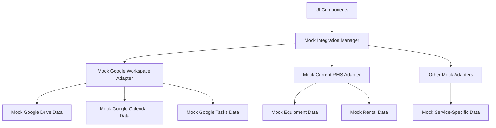

# Integration Details: Investor-Ready-Wireframe-Conversion

This document outlines how external service integrations are mocked in the wireframe implementation to provide a realistic user experience without actual external service connections.

## Integration Architecture

The wireframe implementation maintains the same adapter pattern as the real application but replaces real service connections with mock implementations:



## Mock Integration Manager

In the wireframe-only implementation, the integration manager is entirely mocked with static data:

```typescript
// lib/mock/integrations/mock-integration-manager.ts
export class MockIntegrationManager {
  private static instance: MockIntegrationManager;
  private adapters: Record<string, any> = {};
  
  private constructor() {
    // Initialize with mock adapters
    this.adapters.googleWorkspace = new MockGoogleWorkspaceAdapter();
    this.adapters.currentRMS = new MockCurrentRMSAdapter();
  }
  
  // Singleton pattern
  public static getInstance(): MockIntegrationManager {
    if (!MockIntegrationManager.instance) {
      MockIntegrationManager.instance = new MockIntegrationManager();
    }
    return MockIntegrationManager.instance;
  }
  
  // Get adapter by name
  public getAdapter<T>(name: string): T {
    if (!this.adapters[name]) {
      throw new Error(`Adapter '${name}' not found`);
    }
    return this.adapters[name] as T;
  }
  
  // Get connection status for all adapters
  public getConnectionStatus() {
    return {
      googleWorkspace: {
        connected: true,
        lastSync: new Date().toISOString(),
        error: null
      },
      currentRMS: {
        connected: true,
        lastSync: new Date().toISOString(),
        error: null
      }
    };
  }
}
```

## Mock Adapters

All adapter implementations follow the same interface as their real counterparts but use mock data instead of real service connections.

### Google Workspace Adapter

The Google Workspace mock adapter simulates Google API connections:

```typescript
// lib/mock/integrations/adapters/mock-google-workspace-adapter.ts
export class MockGoogleWorkspaceAdapter implements GoogleWorkspaceAdapterInterface {
  private driveFiles = mockDriveFiles;
  private calendarEvents = mockCalendarEvents;
  private taskLists = mockTaskLists;
  
  // Connection state
  private connected = true;
  
  // Drive methods
  async listFiles(options?: DriveListOptions): Promise<DriveFile[]> {
    await wireframeConfig.delay();
    
    // Apply filtering
    let files = [...this.driveFiles];
    
    if (options?.folderId) {
      files = files.filter(file => file.parentId === options.folderId);
    }
    
    if (options?.searchTerm) {
      const term = options.searchTerm.toLowerCase();
      files = files.filter(file => 
        file.name.toLowerCase().includes(term) || 
        file.description?.toLowerCase().includes(term)
      );
    }
    
    return files;
  }
  
  // Calendar methods
  async listEvents(options?: CalendarListOptions): Promise<CalendarEvent[]> {
    await wireframeConfig.delay();
    
    // Apply filtering
    let events = [...this.calendarEvents];
    
    if (options?.startDate && options?.endDate) {
      events = events.filter(event => {
        const eventStart = new Date(event.start);
        const eventEnd = new Date(event.end);
        const filterStart = new Date(options.startDate);
        const filterEnd = new Date(options.endDate);
        
        return (
          (eventStart >= filterStart && eventStart <= filterEnd) ||
          (eventEnd >= filterStart && eventEnd <= filterEnd) ||
          (eventStart <= filterStart && eventEnd >= filterEnd)
        );
      });
    }
    
    if (options?.calendarId) {
      events = events.filter(event => 
        event.calendarId === options.calendarId
      );
    }
    
    return events;
  }
  
  // Tasks methods
  async listTaskLists(): Promise<TaskList[]> {
    await wireframeConfig.delay();
    return this.taskLists;
  }
  
  // Other methods...
}
```

### Current RMS Adapter

The Current RMS mock adapter simulates equipment rental software integration:

```typescript
// lib/mock/integrations/adapters/mock-current-rms-adapter.ts
export class MockCurrentRMSAdapter implements CurrentRMSAdapterInterface {
  private equipment = mockEquipment;
  private rentals = mockRentals;
  
  // Connection state
  private connected = true;
  
  // Equipment methods
  async listEquipment(options?: EquipmentListOptions): Promise<Equipment[]> {
    await wireframeConfig.delay();
    
    // Apply filtering
    let items = [...this.equipment];
    
    if (options?.categoryId) {
      items = items.filter(item => 
        item.categoryId === options.categoryId
      );
    }
    
    if (options?.searchTerm) {
      const term = options.searchTerm.toLowerCase();
      items = items.filter(item => 
        item.name.toLowerCase().includes(term) || 
        item.description?.toLowerCase().includes(term)
      );
    }
    
    return items;
  }
  
  // Rental methods
  async listRentals(options?: RentalListOptions): Promise<Rental[]> {
    await wireframeConfig.delay();
    
    // Apply filtering
    let items = [...this.rentals];
    
    if (options?.customerId) {
      items = items.filter(item => 
        item.customerId === options.customerId
      );
    }
    
    if (options?.startDate && options?.endDate) {
      // Date filtering logic...
    }
    
    return items;
  }
  
  // Other methods...
}
```

## Authentication Simulation

Each mock adapter includes authentication state simulation:

```typescript
// Example from Google Workspace Adapter
async connect(): Promise<boolean> {
  await wireframeConfig.delay(800); // Longer delay to simulate OAuth flow
  this.connected = true;
  return true;
}

async disconnect(): Promise<boolean> {
  await wireframeConfig.delay(500);
  this.connected = false;
  return true;
}

isConnected(): boolean {
  return this.connected;
}
```

## Mock Data

All integrations use TypeScript files with pre-defined mock data:

```typescript
// lib/mock/data/integrations/google-drive.ts
export interface DriveFile {
  id: string;
  name: string;
  mimeType: string;
  size?: number;
  parentId?: string;
  webViewLink?: string;
  iconLink?: string;
  description?: string;
  createdTime: string;
  modifiedTime: string;
  owners: { displayName: string; emailAddress: string }[];
  shared: boolean;
}

export const mockDriveFiles: DriveFile[] = [
  {
    id: 'folder-root',
    name: 'FOHP Documents',
    mimeType: 'application/vnd.google-apps.folder',
    createdTime: '2023-01-15T10:30:00Z',
    modifiedTime: '2023-05-20T14:45:00Z',
    owners: [
      { 
        displayName: 'Jordan Manager',
        emailAddress: 'manager@example.com'
      }
    ],
    shared: true
  },
  // More mock files...
];
```

## Error Simulation

Mock integrations can simulate various error conditions for testing error handling:

```typescript
async listFiles(options?: DriveListOptions): Promise<DriveFile[]> {
  // Simulate potential random failures
  await wireframeConfig.maybeFailRandomly();
  
  // Rest of implementation...
}
```

## UI Integration

UI components interact with mock adapters through the same hooks and interfaces as the real implementation:

```typescript
// Example of a component using the mock integration
export default function GoogleDriveFiles() {
  const { adapter, isConnected } = useGoogleWorkspace();
  const [files, setFiles] = useState<DriveFile[]>([]);
  const [loading, setLoading] = useState(true);
  
  useEffect(() => {
    const fetchFiles = async () => {
      if (!isConnected) return;
      
      try {
        setLoading(true);
        const result = await adapter.listFiles();
        setFiles(result);
      } catch (error) {
        console.error('Error fetching files:', error);
      } finally {
        setLoading(false);
      }
    };
    
    fetchFiles();
  }, [adapter, isConnected]);
  
  // Render files...
}
```

## Adding New Mock Integrations

To add a new mock integration:

1. **Create Mock Data**: Add a new file in `lib/mock/data/integrations/` with typed mock data
2. **Create Mock Adapter**: Implement a new adapter class in `lib/mock/integrations/adapters/`
3. **Register with Integration Manager**: Add the adapter to the mock integration manager
4. **Update UI Components**: Ensure UI components use the adapter through the integration manager

Example for a new DocuSign integration:

```typescript
// 1. Create mock data
// lib/mock/data/integrations/docusign.ts
export interface Document {
  id: string;
  name: string;
  status: 'draft' | 'sent' | 'completed' | 'declined';
  // ...other properties
}

export const mockDocuments: Document[] = [
  // Mock document data
];

// 2. Create mock adapter
// lib/mock/integrations/adapters/mock-docusign-adapter.ts
export class MockDocuSignAdapter implements DocuSignAdapterInterface {
  private documents = mockDocuments;
  
  // Implementation...
}

// 3. Register with integration manager
// lib/mock/integrations/mock-integration-manager.ts
private constructor() {
  // Initialize with mock adapters
  this.adapters.googleWorkspace = new MockGoogleWorkspaceAdapter();
  this.adapters.currentRMS = new MockCurrentRMSAdapter();
  this.adapters.docuSign = new MockDocuSignAdapter(); // Add new adapter
}
```

## Advantages of the Wireframe-Only Approach

1. **Simpler Architecture**: Direct mock implementations without conditional logic
2. **Consistent Behavior**: Mock integrations always act the same way (no external dependencies)
3. **Faster Development**: No need to handle real authentication flows or API rate limits
4. **Complete Control**: Fine-grained control over simulated data and behavior
5. **Better Demo Experience**: Realistic looking data without connection issues

## Current Implementation Status

| Integration | Status | Mock Data | UI Components |
|-------------|--------|-----------|--------------|
| Google Drive | Implemented | Complete | Complete |
| Google Calendar | Implemented | Basic | Partial |
| Google Tasks | Implemented | Basic | Partial |
| Current RMS | Not Started | Not Started | Not Started |
| DocuSign | Not Started | Not Started | Not Started |

## Next Steps

1. Complete Google Calendar and Tasks UI components
2. Implement Current RMS mock integration
3. Implement DocuSign mock integration
4. Add other planned integrations as needed for investor demos
