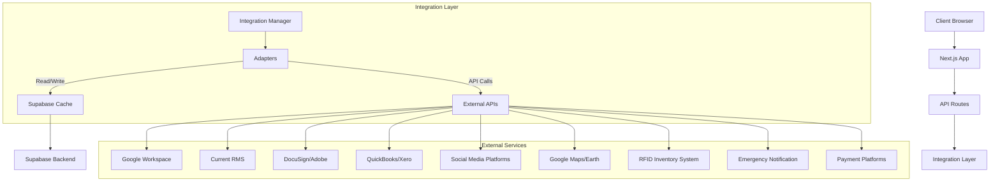
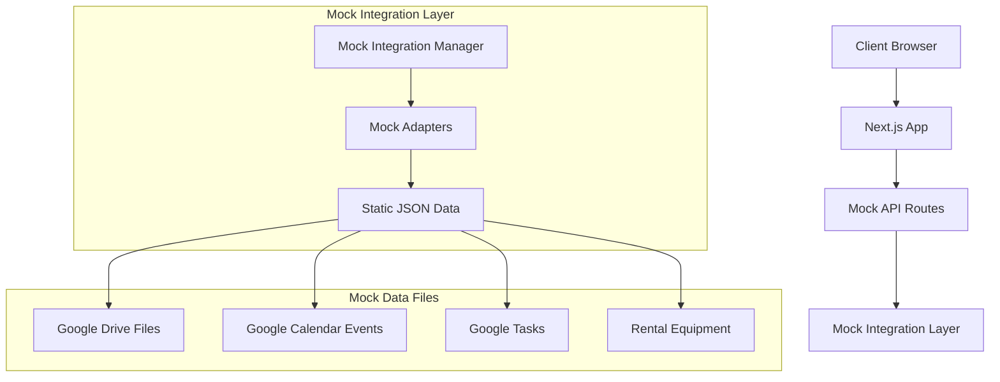

# Integration Details: Investor-Ready-Wireframe-Conversion

This document details how we'll convert the current real integrations in the FOHP application to mock implementations for the investor wireframe version, with a focus on maintaining visual fidelity while removing backend dependencies.

## Current Integration Architecture

The FOHP application currently implements a sophisticated integration architecture:



### Key Components to Replace

1. **Integration Manager**: Central coordination service for all external service adapters
2. **BaseAdapter and Service-Specific Adapters**: Interface and implementations for service integrations
3. **Caching Layer**: Database tables in Supabase for caching external data
4. **API Routes**: Next.js API routes for secure access to external services
5. **Authentication Flows**: OAuth and API key credential management
6. **External Service API Calls**: Direct calls to Google Workspace and other services

## Mock Integration Strategy

For the wireframe version, we'll replace these components with:



## Google Workspace Integration Replacement

### Current Implementation

The Google Workspace integration currently includes:
- OAuth authentication flow for connecting Google accounts
- API routes for accessing Google Drive, Calendar, and Tasks
- Database caching of Google data in Supabase tables
- UI components for displaying Google data
- Background synchronization jobs

### Wireframe Replacement

#### 1. Mock Google Authentication

```typescript
// Example of mock Google auth implementation
export const mockGoogleAuth = {
  isConnected: true,
  connect: async () => {
    // Simulate connection flow (just set connected state)
    return { success: true };
  },
  disconnect: async () => {
    // Simulate disconnection
    return { success: true };
  },
  refreshToken: async () => {
    // Simulate token refresh
    return { success: true };
  }
};
```

#### 2. Mock Google Drive Files

```json
[
  {
    "id": "file-1",
    "name": "Event Contract.pdf",
    "mimeType": "application/pdf",
    "webViewLink": "#",
    "thumbnailLink": "/mock-files/pdf-thumbnail.png",
    "createdTime": "2025-01-15T14:30:00Z",
    "size": "245700"
  },
  {
    "id": "file-2",
    "name": "Stage Plot.jpg",
    "mimeType": "image/jpeg",
    "webViewLink": "#",
    "thumbnailLink": "/mock-files/image-thumbnail.jpg",
    "createdTime": "2025-01-18T09:15:00Z",
    "size": "1250000"
  },
  {
    "id": "folder-1",
    "name": "Event Documentation",
    "mimeType": "application/vnd.google-apps.folder",
    "webViewLink": "#",
    "createdTime": "2025-01-10T11:45:00Z"
  }
]
```

#### 3. Mock Google Calendar Events

```json
[
  {
    "id": "event-1",
    "summary": "Corporate Event Setup",
    "start": {
      "dateTime": "2025-03-25T08:00:00Z"
    },
    "end": {
      "dateTime": "2025-03-25T12:00:00Z"
    },
    "location": "Convention Center, Dallas, TX",
    "status": "confirmed",
    "description": "Setup for the annual corporate conference"
  },
  {
    "id": "event-2",
    "summary": "Wedding Reception",
    "start": {
      "dateTime": "2025-04-02T16:00:00Z"
    },
    "end": {
      "dateTime": "2025-04-02T23:00:00Z"
    },
    "location": "Grand Ballroom, Hilton Hotel",
    "status": "confirmed",
    "description": "Full A/V setup with lighting and sound systems"
  }
]
```

#### 4. Mock Google Tasks

```json
[
  {
    "id": "tasklist-1",
    "title": "Event Preparation",
    "tasks": [
      {
        "id": "task-1",
        "title": "Check equipment inventory",
        "notes": "Verify all items on the equipment list are available",
        "completed": true,
        "due": "2025-03-23T17:00:00Z"
      },
      {
        "id": "task-2",
        "title": "Contact venue manager",
        "notes": "Confirm access time and loading dock availability",
        "completed": false,
        "due": "2025-03-24T12:00:00Z"
      }
    ]
  },
  {
    "id": "tasklist-2",
    "title": "Post-Event",
    "tasks": [
      {
        "id": "task-3",
        "title": "Inventory check-in",
        "notes": "Log all returned equipment and note any damages",
        "completed": false,
        "due": "2025-03-26T10:00:00Z"
      }
    ]
  }
]
```

#### 5. Mock API Implementation

```typescript
// Example of mock Google Drive API route
export async function GET(req: Request) {
  // Add artificial delay for realism
  await new Promise(resolve => setTimeout(resolve, 300));
  
  // Return mock data
  return Response.json({ 
    files: mockDriveFiles,
    nextPageToken: null
  });
}
```

#### 6. Mock Integration Components

```typescript
// Example of mock Google Drive adapter
export class MockGoogleDriveAdapter {
  async listFiles(folderId?: string, pageToken?: string) {
    // Filter files based on folder ID if provided
    const files = folderId 
      ? mockDriveFiles.filter(file => file.parents?.includes(folderId))
      : mockDriveFiles;
      
    return {
      files,
      nextPageToken: null
    };
  }
  
  async getFile(fileId: string) {
    return mockDriveFiles.find(file => file.id === fileId) || null;
  }
  
  // Additional methods as needed
}
```

## Current RMS Integration Replacement

### Current Implementation Status

The Current RMS integration is currently in the planning phase and not fully implemented. For the wireframe version, we'll create static mock data that simulates what this integration would look like.

### Wireframe Implementation

#### 1. Mock Equipment Data

```json
[
  {
    "id": "equip-1",
    "name": "JBL PRX835W 15\" Three-Way Powered Speaker",
    "category": "Speakers",
    "subcategory": "Powered Speakers",
    "dailyRate": 75.00,
    "weeklyRate": 225.00,
    "availability": "in_stock",
    "imageUrl": "/mock-equipment/speaker.jpg",
    "specifications": {
      "power": "1500W",
      "weight": "63.9 lbs",
      "dimensions": "17.5 x 16.5 x 33.75 in"
    }
  },
  {
    "id": "equip-2",
    "name": "Shure SM58 Vocal Microphone",
    "category": "Microphones",
    "subcategory": "Dynamic Microphones",
    "dailyRate": 20.00,
    "weeklyRate": 60.00,
    "availability": "in_stock",
    "imageUrl": "/mock-equipment/mic.jpg",
    "specifications": {
      "type": "Dynamic",
      "pattern": "Cardioid",
      "frequency": "50Hz-15kHz"
    }
  }
]
```

#### 2. Mock Rental Management

```json
[
  {
    "id": "rental-1",
    "customer": {
      "id": "cust-1",
      "name": "Acme Corporation",
      "email": "events@acmecorp.example"
    },
    "status": "confirmed",
    "dateRange": {
      "start": "2025-04-10T08:00:00Z",
      "end": "2025-04-12T18:00:00Z"
    },
    "items": [
      {
        "id": "equip-1",
        "quantity": 4,
        "dailyRate": 75.00
      },
      {
        "id": "equip-3",
        "quantity": 1,
        "dailyRate": 150.00
      }
    ],
    "venue": {
      "name": "Grand Convention Center",
      "address": "123 Main St, Dallas, TX"
    },
    "total": 1200.00
  }
]
```

#### 3. Mock API Implementation

```typescript
// Example of mock rental API route
export async function GET(req: Request) {
  // Extract parameters
  const url = new URL(req.url);
  const customerId = url.searchParams.get('customerId');
  
  // Filter rentals if customer ID provided
  const rentals = customerId
    ? mockRentals.filter(rental => rental.customer.id === customerId)
    : mockRentals;
    
  await new Promise(resolve => setTimeout(resolve, 400));
  
  return Response.json({ rentals });
}
```

## DocuSign/Adobe Integration Replacement

### Wireframe Implementation

Since this integration is planned but not implemented, we'll create simple mock data to represent document signing:

```json
[
  {
    "id": "doc-1",
    "name": "Event Contract",
    "status": "sent",
    "sentDate": "2025-03-15T10:30:00Z",
    "recipients": [
      {
        "name": "John Smith",
        "email": "john@example.com",
        "status": "signed",
        "signedDate": "2025-03-16T14:22:00Z"
      }
    ],
    "documentUrl": "#"
  },
  {
    "id": "doc-2",
    "name": "Equipment Rental Agreement",
    "status": "draft",
    "recipients": [],
    "documentUrl": "#"
  }
]
```

## Integration UI Components

For each integration, we'll maintain the existing UI components but adapt them to use mock data:

1. **Google Drive**: File list and preview components
2. **Google Calendar**: Event list and calendar view components
3. **Google Tasks**: Task list and task detail components
4. **Equipment Catalog**: Equipment list and detail components
5. **Rental Management**: Rental history and booking components
6. **Document Signing**: Document list and signing flow components

Each UI component will maintain its original visual design but connect to mock data services instead of real APIs.

## Mock Connection Status Management

To simulate service connection status:

```typescript
export const mockConnectionStatus = {
  google: {
    connected: true,
    lastSync: "2025-03-19T15:30:00Z",
    error: null
  },
  currentRMS: {
    connected: true,
    lastSync: "2025-03-19T14:45:00Z",
    error: null
  },
  docuSign: {
    connected: false,
    lastSync: null,
    error: "Authentication required"
  }
};
```

## Implementation Plan

1. **Create Mock Data Files**:
   - Define all necessary mock JSON data
   - Organize by service and entity type
   - Ensure data relationships are maintained

2. **Implement Mock Services**:
   - Create mock versions of all adapters
   - Implement the same interfaces as real services
   - Add realistic delays and error simulation

3. **Update API Routes**:
   - Convert all API routes to return mock data
   - Maintain the same API contract
   - Support filtering and pagination where needed

4. **Update UI Components**:
   - Ensure all components use mock services
   - Maintain loading states and error handling
   - Preserve all visual elements

5. **Test Integration Flows**:
   - Verify all integration UI flows work with mock data
   - Test error states and loading indicators
   - Validate role-based access to integration features

This approach will provide a visually complete and interactive representation of all integration features without requiring real service connections, making it ideal for investor demonstrations.
