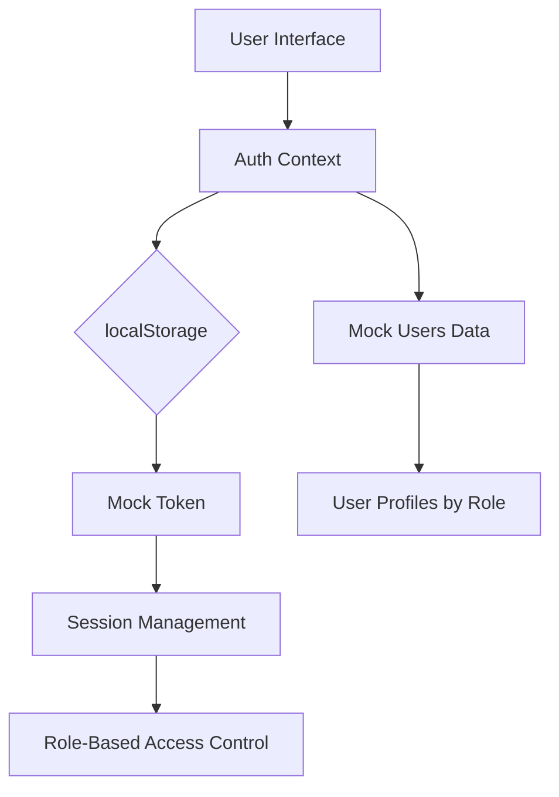
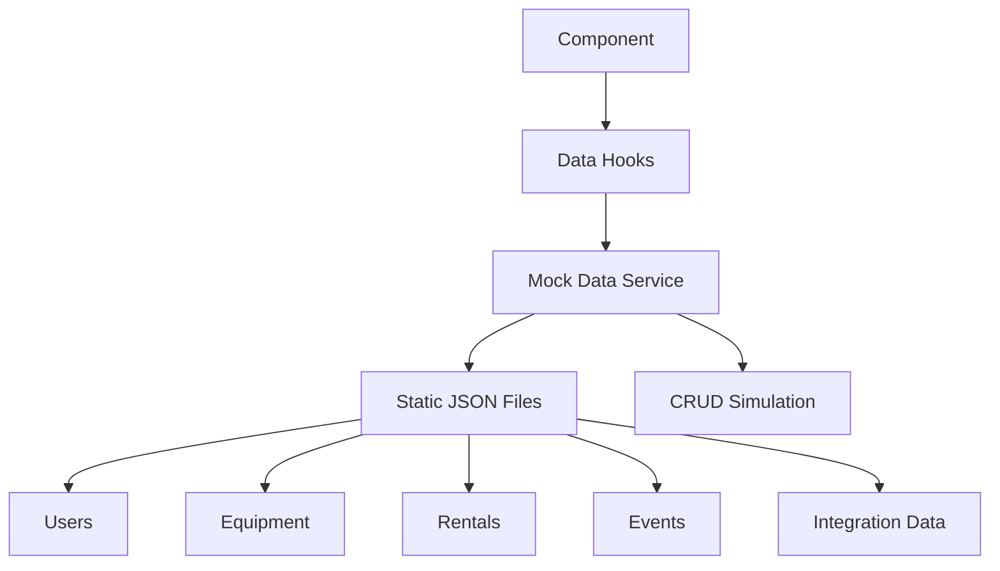
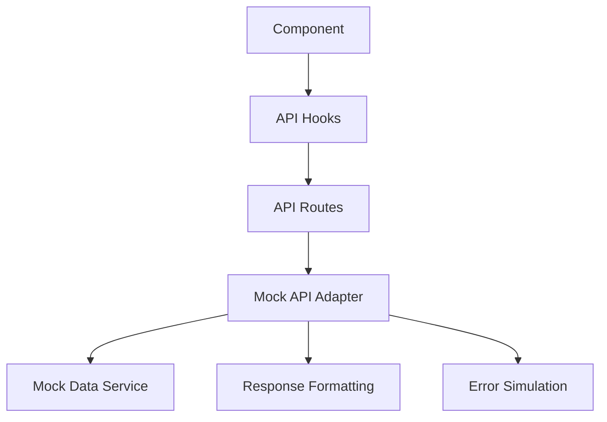
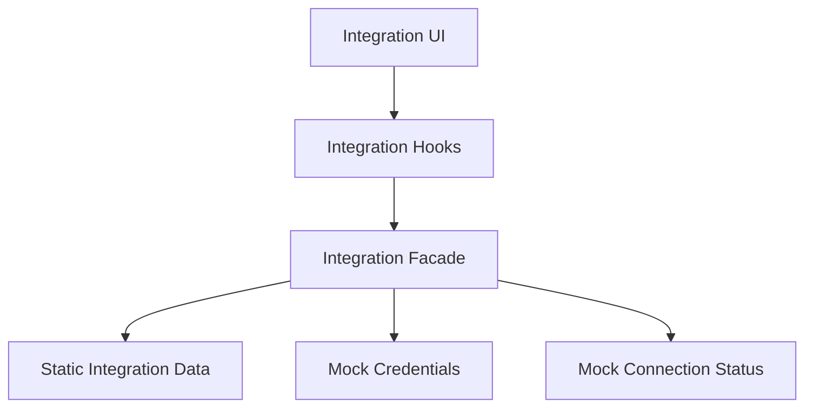
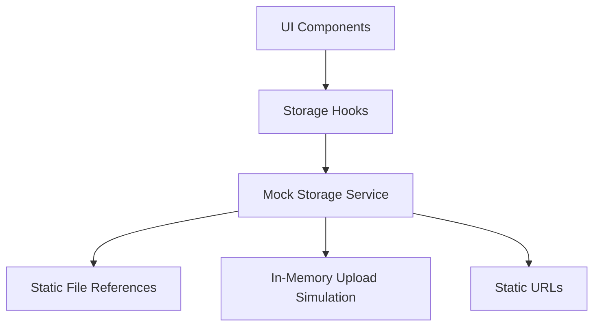
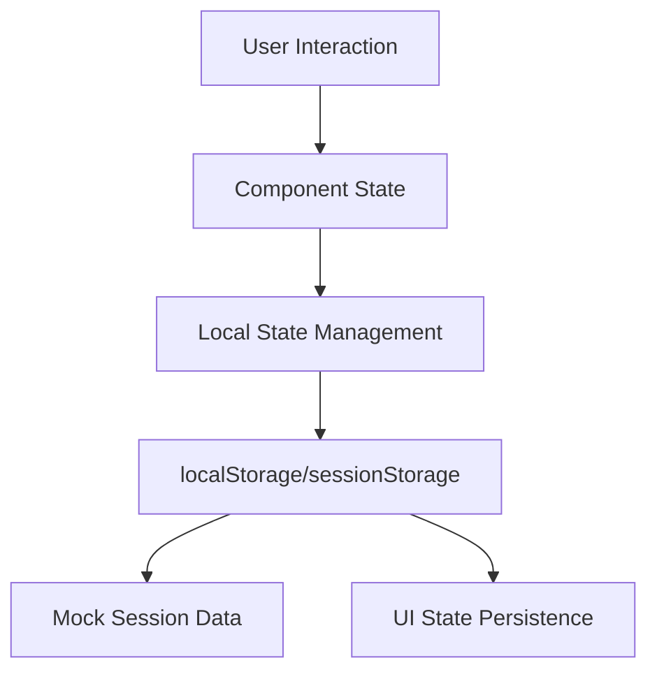
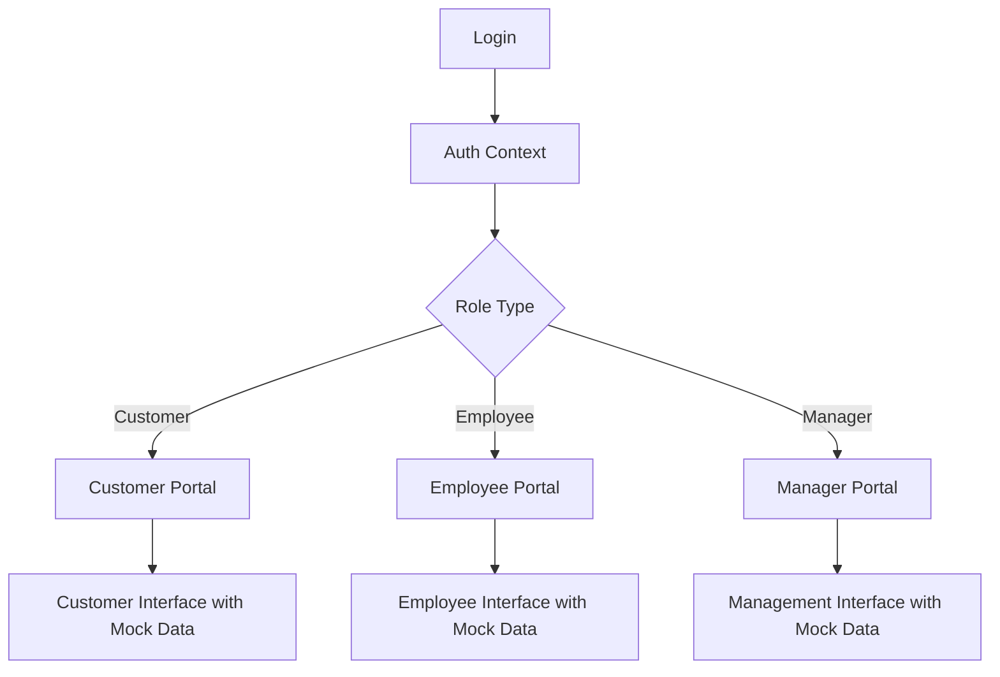
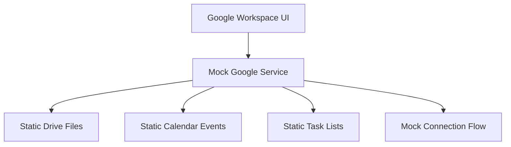
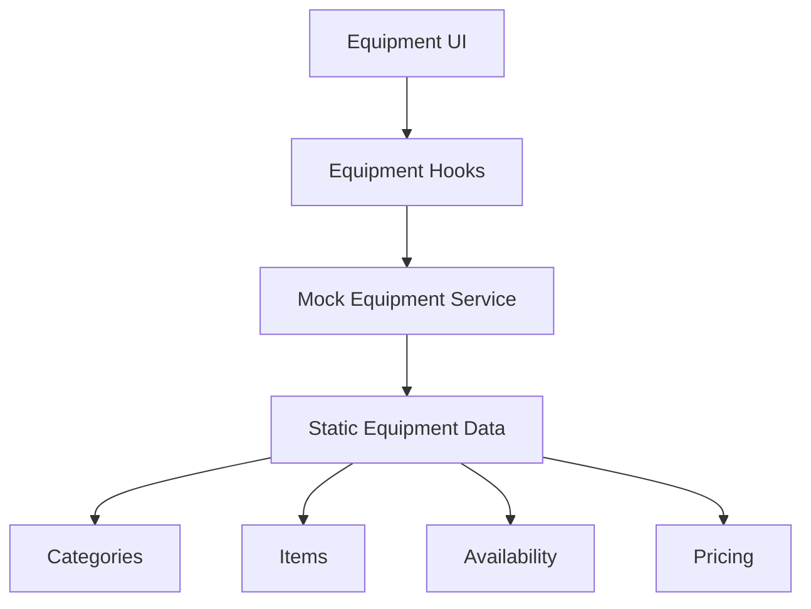
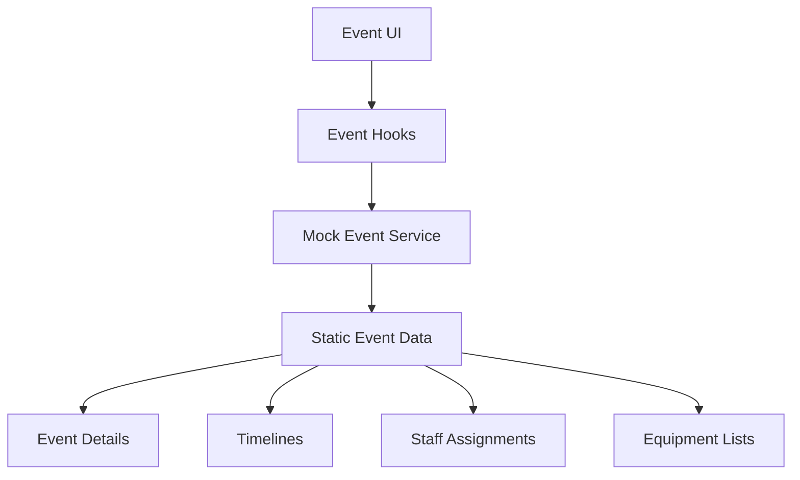

# Relevant Patterns: Investor-Ready-Wireframe-Conversion

This document outlines the key design patterns and implementation strategies we'll use for converting the Front of House Productions (FOHP) application to a wireframe version.

## Mock Implementation Patterns

### 1. Mock Authentication Pattern

**Implementation Strategy**:
- Create a React Context Provider to manage authentication state
- Store authentication state in localStorage or cookies
- Include hardcoded user profiles for different roles (customer, employee, manager)
- Implement a simple token-based mechanism to simulate real JWT
- Maintain session expiration simulation for realism
- Preserve login/signup UI flows with backend calls replaced by static data

### 2. Static Data Repository Pattern

**Implementation Strategy**:
- Create a centralized mock data service
- Organize static JSON files by entity type
- Implement helper functions that mimic database operations:
  - `getAll`: Return full collections
  - `getById`: Filter collections by ID
  - `getByFilter`: Apply filters to collections
  - `create`: Simulate creation (in-memory only)
  - `update`: Simulate updates (in-memory only)
  - `delete`: Simulate deletion (in-memory only)
- Maintain referential integrity between related mock data
- Include realistic delay simulation for operations

### 3. Mock API Adapter Pattern

**Implementation Strategy**:
- Maintain the same API route structure
- Replace real API calls with mock data responses
- Preserve response formats to maintain UI compatibility
- Implement simulated latency for realism
- Include error state simulation for testing error handling
- Support filtering, pagination, and sorting in mock responses

### 4. Integration Facade Pattern

**Implementation Strategy**:
- Create facade classes that mimic the original integration adapters
- Replace real API calls with mock data responses
- Simulate connection status and authentication flows
- Maintain the same interface as real integrations
- Use static data for:
  - Google Drive files and folders
  - Calendar events
  - Task lists and items
- Preserve visual components while simplifying the backend

### 5. Mock Storage Pattern

**Implementation Strategy**:
- Replace Supabase Storage with static file references
- Create a mock storage service with the same interface
- Simulate file uploads and downloads (client-side only)
- Use predefined static URLs for file references
- Include sample files for different types (images, documents, etc.)

### 6. State Preservation Pattern

**Implementation Strategy**:
- Use localStorage/sessionStorage for state persistence
- Implement client-side state management without server synchronization
- Preserve user interactions within session lifespan
- Reset to initial state on "logout" or session expiration
- Maintain realistic interaction feedback

## Application-Specific Implementation Patterns

### 1. Role-Based Portal Simulation

**Implementation Details**:
- Preserve the portal switching mechanism based on user role
- Use role-specific mock data for each portal view
- Maintain consistent navigation and access control based on role
- Simulate permission checks without database RLS

### 2. Google Workspace Integration Simulation

**Implementation Details**:
- Replace OAuth flow with mock authentication simulation
- Use static file data for Google Drive interface
- Create realistic sample calendar events
- Implement static task lists that mimic Google Tasks
- Simulate connection/disconnection functionality
- Maintain visual consistency with actual integration

### 3. Equipment Catalog Simulation

**Implementation Details**:
- Create comprehensive mock equipment data with:
  - Categories and subcategories
  - Equipment specifications
  - Availability dates
  - Pricing information
  - Images and descriptions
- Implement filtering and search functionality
- Simulate the rental selection process

### 4. Event Management Simulation

**Implementation Details**:
- Create mock event data with:
  - Event details and metadata
  - Timeline information
  - Equipment lists
  - Staff assignments
  - Venue specifications
- Simulate the event creation and management workflow
- Maintain timeline visualization functionality

## Implementation Best Practices

1. **Separation of Concerns**:
   - Keep mock services separate from UI components
   - Use clear interfaces that match original services
   - Maintain the component hierarchy of the original application

2. **Code Organization**:
   - Create a dedicated `/lib/mock` directory for all mock implementations
   - Organize mock data by entity type
   - Use consistent naming conventions for mock services

3. **Visual Consistency**:
   - Ensure all mock data drives the same visual experience
   - Maintain responsive design with mock data
   - Preserve loading states and transitions

4. **Type Safety**:
   - Maintain TypeScript interfaces from the original application
   - Ensure mock data adheres to defined types
   - Use type guards for runtime validation

5. **Performance Considerations**:
   - Simulate realistic loading times
   - Implement pagination for large data sets
   - Optimize static asset loading

6. **Development Workflow**:
   - Create mock implementations incrementally
   - Test each mock service independently
   - Ensure cross-browser compatibility

## Migration Strategy

When implementing these patterns, we'll follow this sequence:

1. Create the core mock data structure and authentication system
2. Replace Supabase client with mock data services
3. Implement mock API routes
4. Replace integration adapters with mock facades
5. Update UI components to work with mock services
6. Test the complete application flow
7. Optimize for deployment

This structured approach ensures we maintain visual and functional consistency while removing backend dependencies.
