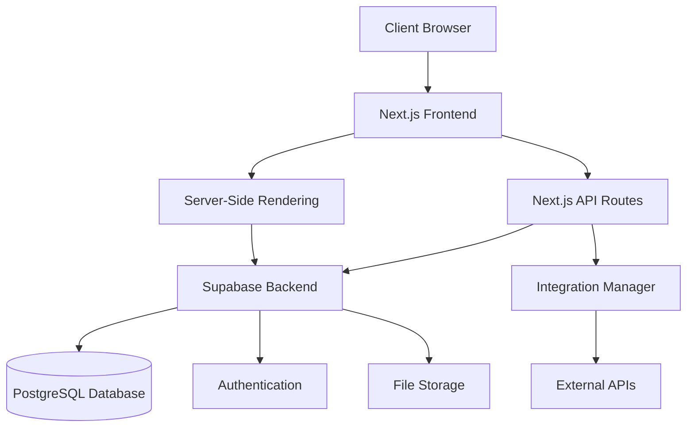
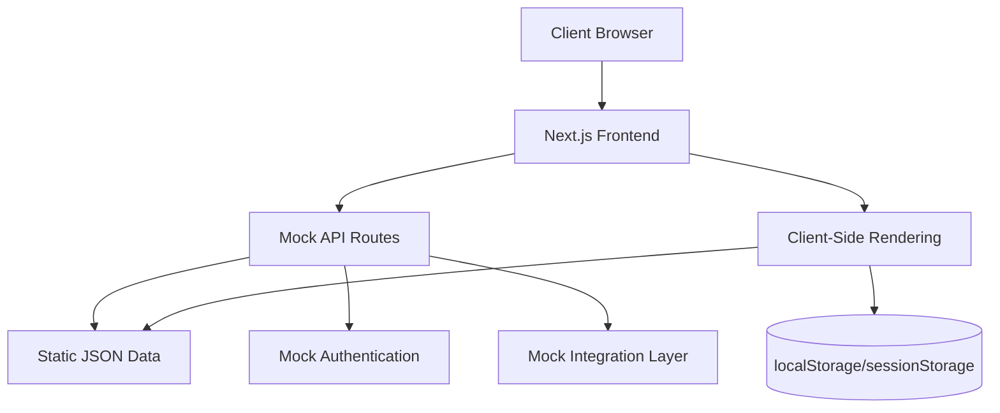
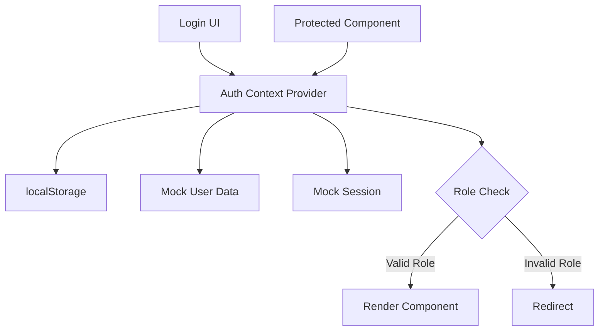
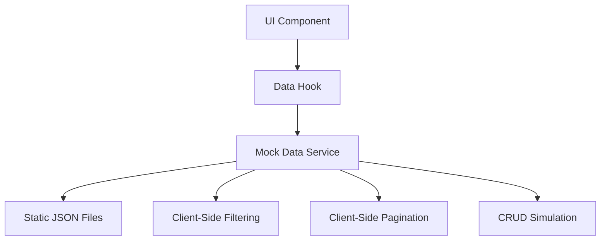
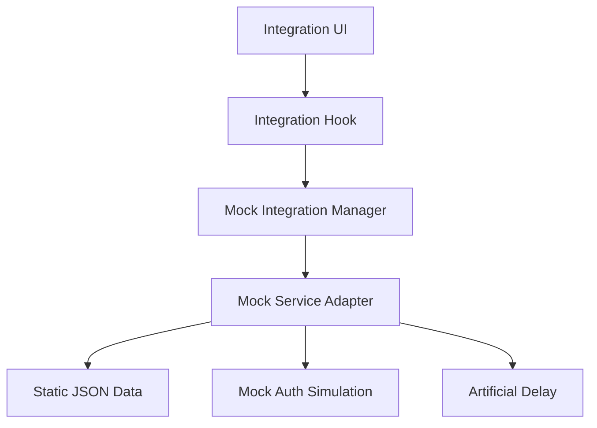
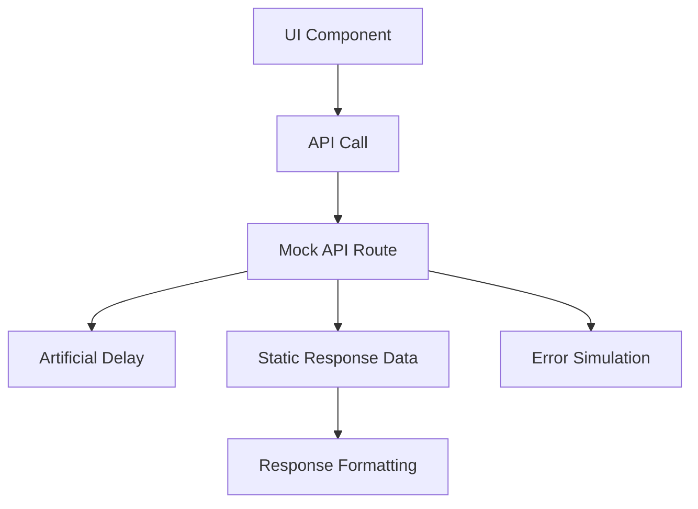
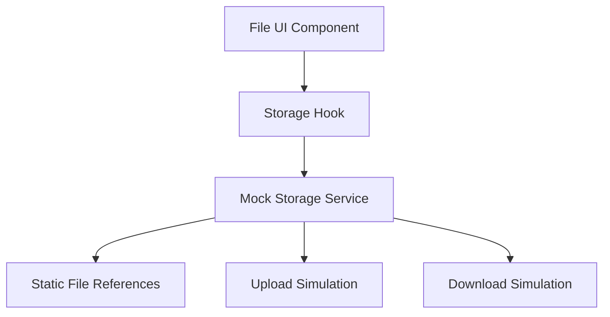

# Wireframe Architecture: Investor-Ready-Wireframe-Conversion

This document details the architectural changes required to convert the current FOHP application into a wireframe version for investor demonstrations, focusing on the technical implementation.

## Current vs. Wireframe Architecture

### Current Architecture



### Wireframe Architecture



## Key Architecture Changes

### 1. Authentication Architecture

#### Current
- JWT-based authentication through Supabase Auth
- Server-side session validation
- Role-based security with database RLS policies
- OAuth integration for Google authentication

#### Wireframe
- ClientAuth React Context for managing authentication state
- localStorage-based user session management
- Role-based UI control without database RLS
- Simulated OAuth flows without actual provider integration



### 2. Data Access Architecture

#### Current
- Supabase database access through client library
- Server-side data fetching with security policies
- Real-time subscriptions for data updates
- Database migrations for schema management

#### Wireframe
- Static JSON data files for all entities
- Mock data service with CRUD simulation
- Client-side data filtering and pagination
- No database migrations or schema management



### 3. Integration Architecture

#### Current
- Integration Manager coordinates service adapters
- Each external service has a dedicated adapter
- API routes secure external service credentials
- Database caching for external data
- Background sync jobs for data freshness

#### Wireframe
- Mock integration manager with static responses
- Mock adapters replacing real service adapters
- API routes returning static mock data
- No database caching or background jobs
- Simulated connection status and auth flows



### 4. API Route Architecture

#### Current
- Server-side execution of API routes
- Connection to Supabase for data access
- External API calls with credential management
- Error handling and retry logic

#### Wireframe
- Client-side simulation of API routes where possible
- Static data responses from API routes
- Simulated latency for realistic behavior
- Basic error simulation without retry logic



### 5. File Storage Architecture

#### Current
- Supabase Storage for file management
- Secure URLs with token authentication
- File upload with progress tracking
- Access control based on user roles

#### Wireframe
- Static file references for display
- Mock upload/download functionality
- Predefined file URLs without tokens
- Client-side only storage simulation



## Implementation Details

### 1. Directory Structure Changes

```
frontend/
├── lib/
│   ├── mock/                        # New directory for mock implementations
│   │   ├── data/                    # Static JSON data files
│   │   │   ├── users.ts             # Mock user data
│   │   │   ├── equipment.ts         # Mock equipment data
│   │   │   ├── rentals.ts           # Mock rental data
│   │   │   ├── events.ts            # Mock event data
│   │   │   └── integrations/        # Mock integration data
│   │   │       ├── google-drive.ts  # Mock Google Drive data
│   │   │       ├── google-calendar.ts # Mock Calendar data
│   │   │       └── google-tasks.ts  # Mock Tasks data
│   │   ├── services/                # Mock service implementations
│   │   │   ├── mock-auth-service.ts # Mock authentication service
│   │   │   ├── mock-data-service.ts # Mock data access service
│   │   │   └── mock-storage-service.ts # Mock file storage service
│   │   └── integrations/            # Mock integration adapters
│   │       ├── mock-integration-manager.ts # Mock integration manager
│   │       └── adapters/            # Mock service adapters
│   │           ├── mock-google-workspace-adapter.ts
│   │           └── mock-current-rms-adapter.ts
│   ├── context/                     # React contexts
│   │   └── auth-context.tsx         # Mock authentication context
│   ├── hooks/                       # React hooks using mock services
│   │   ├── use-auth.ts              # Hook for mock authentication
│   │   ├── use-data.ts              # Hook for mock data access
│   │   └── use-integrations.ts      # Hook for mock integrations
│   └── utils/                       # Utility functions
│       └── mock-helpers.ts          # Helpers for mock implementations
├── app/
│   ├── api/                         # API routes using mock data
│   │   └── [...mock routes].ts      # Various mock API endpoints
│   └── [...site pages]              # Same as before, now using mock services
└── public/
    └── mock-files/                  # Static mock files (images, docs, etc.)
```

### 2. Key File Implementations

#### a. Auth Context Provider

```tsx
// lib/context/auth-context.tsx
import { createContext, useContext, useState, useEffect } from 'react';
import { mockUsers } from '../mock/data/users';

// Create auth context
export const AuthContext = createContext<AuthContextType>(null);

// Auth provider component
export function AuthProvider({ children }) {
  const [user, setUser] = useState(null);
  const [loading, setLoading] = useState(true);
  
  // On mount, check localStorage for existing session
  useEffect(() => {
    const storedUser = localStorage.getItem('mockAuthUser');
    if (storedUser) {
      setUser(JSON.parse(storedUser));
    }
    setLoading(false);
  }, []);
  
  // Sign in function
  const signIn = async ({ email, password }) => {
    // Find user in mock data
    const mockUser = mockUsers.find(u => 
      u.email === email && u.password === password
    );
    
    if (mockUser) {
      // Create session with expiration
      const session = {
        ...mockUser,
        token: `mock-token-${Date.now()}`,
        expires: new Date(Date.now() + 24 * 60 * 60 * 1000).toISOString(),
      };
      
      // Store in localStorage and state
      localStorage.setItem('mockAuthUser', JSON.stringify(session));
      setUser(session);
      return { user: session, error: null };
    }
    
    return { user: null, error: { message: 'Invalid credentials' } };
  };
  
  // Sign out function
  const signOut = async () => {
    localStorage.removeItem('mockAuthUser');
    setUser(null);
    return { error: null };
  };
  
  // Sign up function
  const signUp = async ({ email, password, ...userData }) => {
    // Create new user with defaults
    const newUser = {
      id: `user-${Date.now()}`,
      email,
      password, // In a real app, never store plaintext passwords
      role: 'customer',
      created_at: new Date().toISOString(),
      ...userData
    };
    
    // In real implementation, we would add to database
    // For mock, we'll just simulate success
    
    return { user: newUser, error: null };
  };
  
  return (
    <AuthContext.Provider value={{
      user,
      loading,
      signIn,
      signOut,
      signUp,
    }}>
      {children}
    </AuthContext.Provider>
  );
}

// Hook for using auth
export const useAuth = () => useContext(AuthContext);
```

#### b. Mock Data Service

```tsx
// lib/mock/services/mock-data-service.ts
import { mockEquipment } from '../data/equipment';
import { mockRentals } from '../data/rentals';
import { mockEvents } from '../data/events';

// Generic mock data service with CRUD operations
export class MockDataService<T extends { id: string }> {
  private data: T[];
  private entityName: string;
  
  constructor(data: T[], entityName: string) {
    this.data = [...data]; // Clone to avoid mutations
    this.entityName = entityName;
  }
  
  // Get all items with optional filtering
  async getAll(filters?: Record<string, any>) {
    // Simulate network delay
    await this.delay();
    
    if (!filters) return [...this.data];
    
    // Apply filters
    return this.data.filter(item => {
      return Object.entries(filters).every(([key, value]) => {
        return item[key] === value;
      });
    });
  }
  
  // Get item by ID
  async getById(id: string) {
    await this.delay();
    const item = this.data.find(item => item.id === id);
    
    if (!item) {
      throw new Error(`${this.entityName} with ID ${id} not found`);
    }
    
    return { ...item };
  }
  
  // Create new item
  async create(data: Omit<T, 'id'>) {
    await this.delay();
    
    // Generate ID
    const id = `${this.entityName.toLowerCase()}-${Date.now()}`;
    const newItem = { ...data, id } as T;
    
    // In real implementation, we would add to database
    // For mock, we'll add to in-memory array
    this.data.push(newItem);
    
    return { ...newItem };
  }
  
  // Update item
  async update(id: string, data: Partial<T>) {
    await this.delay();
    
    const index = this.data.findIndex(item => item.id === id);
    if (index === -1) {
      throw new Error(`${this.entityName} with ID ${id} not found`);
    }
    
    // Update item
    this.data[index] = { ...this.data[index], ...data };
    
    return { ...this.data[index] };
  }
  
  // Delete item
  async delete(id: string) {
    await this.delay();
    
    const index = this.data.findIndex(item => item.id === id);
    if (index === -1) {
      throw new Error(`${this.entityName} with ID ${id} not found`);
    }
    
    // Remove item
    this.data.splice(index, 1);
    
    return { success: true };
  }
  
  // Helper for simulating network delay
  private async delay(ms = 300) {
    return new Promise(resolve => setTimeout(resolve, ms));
  }
}

// Export pre-configured services
export const equipmentService = new MockDataService(mockEquipment, 'Equipment');
export const rentalService = new MockDataService(mockRentals, 'Rental');
export const eventService = new MockDataService(mockEvents, 'Event');
```

#### c. Mock Integration Manager

```tsx
// lib/mock/integrations/mock-integration-manager.ts
import { MockGoogleWorkspaceAdapter } from './adapters/mock-google-workspace-adapter';
import { MockCurrentRMSAdapter } from './adapters/mock-current-rms-adapter';

// Mock implementation of the integration manager
export class MockIntegrationManager {
  private static instance: MockIntegrationManager;
  private adapters: Record<string, any> = {};
  
  private constructor() {
    // Initialize with mock adapters
    this.adapters.googleWorkspace = new MockGoogleWorkspaceAdapter();
    this.adapters.currentRMS = new MockCurrentRMSAdapter();
  }
  
  // Singleton pattern
  public static getInstance(): MockIntegrationManager {
    if (!MockIntegrationManager.instance) {
      MockIntegrationManager.instance = new MockIntegrationManager();
    }
    return MockIntegrationManager.instance;
  }
  
  // Get adapter by name
  public getAdapter<T>(name: string): T {
    if (!this.adapters[name]) {
      throw new Error(`Adapter '${name}' not found`);
    }
    return this.adapters[name] as T;
  }
  
  // Get connection status for all adapters
  public getConnectionStatus() {
    return {
      googleWorkspace: {
        connected: true,
        lastSync: new Date().toISOString(),
        error: null
      },
      currentRMS: {
        connected: true,
        lastSync: new Date().toISOString(),
        error: null
      }
    };
  }
}

// Export singleton instance
export const mockIntegrationManager = MockIntegrationManager.getInstance();
```

#### d. API Route Example

```tsx
// app/api/equipment/route.ts
import { mockEquipment } from '@/lib/mock/data/equipment';

export async function GET(req: Request) {
  // Simulate network delay
  await new Promise(resolve => setTimeout(resolve, 300));
  
  // Get query parameters
  const url = new URL(req.url);
  const category = url.searchParams.get('category');
  const search = url.searchParams.get('search');
  
  // Filter data based on parameters
  let data = [...mockEquipment];
  
  if (category) {
    data = data.filter(item => item.category === category);
  }
  
  if (search) {
    const searchLower = search.toLowerCase();
    data = data.filter(item => 
      item.name.toLowerCase().includes(searchLower) || 
      item.description?.toLowerCase().includes(searchLower)
    );
  }
  
  return Response.json({ 
    data,
    count: data.length
  });
}

export async function POST(req: Request) {
  // Simulate network delay
  await new Promise(resolve => setTimeout(resolve, 500));
  
  try {
    const body = await req.json();
    
    // Generate ID
    const id = `equip-${Date.now()}`;
    const newEquipment = { ...body, id };
    
    // In a real implementation, we would add to the database
    // For mock, we'll just return success with the new item
    
    return Response.json({ 
      data: newEquipment,
      success: true
    });
  } catch (error) {
    return Response.json(
      { error: 'Invalid request' },
      { status: 400 }
    );
  }
}
```

## Next.js Configuration Changes

### 1. Environment Variables

Replace Supabase and external API environment variables with mock flags:

```
# .env.local
NEXT_PUBLIC_MOCK_ENABLED=true
NEXT_PUBLIC_MOCK_DELAY=300
```

### 2. next.config.ts Updates

```typescript
/** @type {import('next').NextConfig} */
const nextConfig = {
  reactStrictMode: true,
  images: {
    domains: [
      'example.com',
      'lh3.googleusercontent.com',
      'localhost'
    ],
  },
  // Static exports option could be enabled for fully static builds
  // output: 'export',
  eslint: {
    ignoreDuringBuilds: true,
  },
};

module.exports = nextConfig;
```

## Page Implementation Strategy

All pages will keep their current structure but will be updated to use mock services instead of real ones:

1. **Authentication Pages**: Use mock auth context instead of Supabase Auth
2. **Dashboard Pages**: Use mock data services instead of Supabase queries
3. **Integration Pages**: Use mock integration adapters instead of real ones
4. **Profile Pages**: Maintain UI but connect to mock user data

```tsx
// Example of converted dashboard page
import { useAuth } from '@/lib/hooks/use-auth';
import { useMockData } from '@/lib/hooks/use-mock-data';

export default function DashboardPage() {
  const { user } = useAuth();
  const { data: events, loading } = useMockData('events');
  
  if (loading) return <LoadingSpinner />;
  
  return (
    <DashboardLayout>
      <h1>Welcome, {user?.name}</h1>
      <EventsList events={events} />
      {/* Rest of the dashboard UI */}
    </DashboardLayout>
  );
}
```

## Deployment Considerations

### Vercel Deployment

The wireframe version will be simpler to deploy to Vercel:

1. **No Backend Dependencies**: No Supabase or external service connections required
2. **Environment Variables**: Only basic Next.js configuration needed
3. **Build Optimization**: Faster builds without database migrations
4. **Preview Deployments**: Easier to set up preview environments

### Potential Optimizations

1. **Static Generation**: Consider using `next export` for fully static generation
2. **Image Optimization**: Pre-optimize mock images for faster loading
3. **Bundle Size**: Remove unused dependencies related to Supabase and external APIs
4. **Caching**: Implement aggressive caching for static mock data

## Migration Steps

1. Create the mock directory structure
2. Implement core mock services (auth, data, storage)
3. Create static JSON data files
4. Update API routes to use mock data
5. Convert UI components to use mock services
6. Update Next.js configuration
7. Test deployment to Vercel

This architecture provides a complete blueprint for converting the FOHP application into a wireframe version that maintains visual fidelity and user experience while removing backend dependencies.
