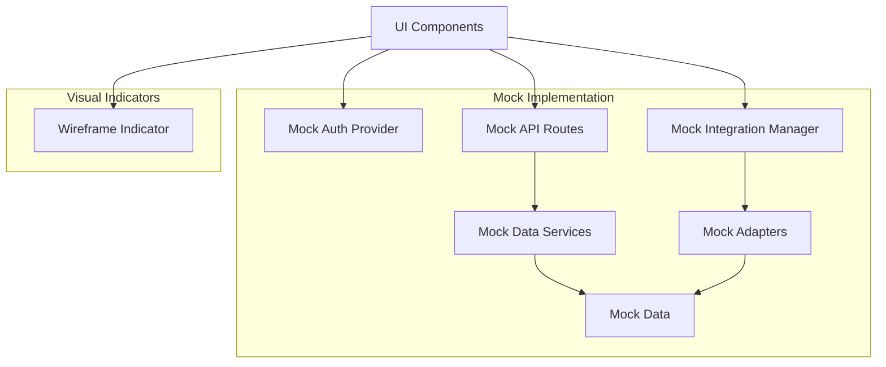
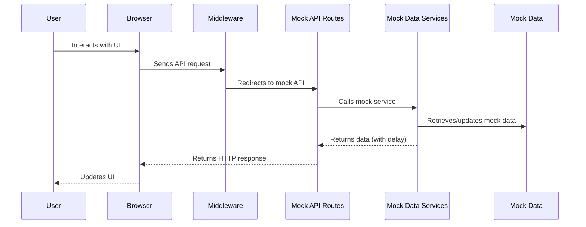
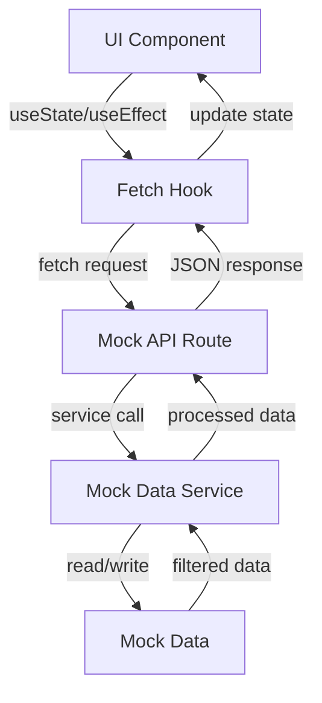
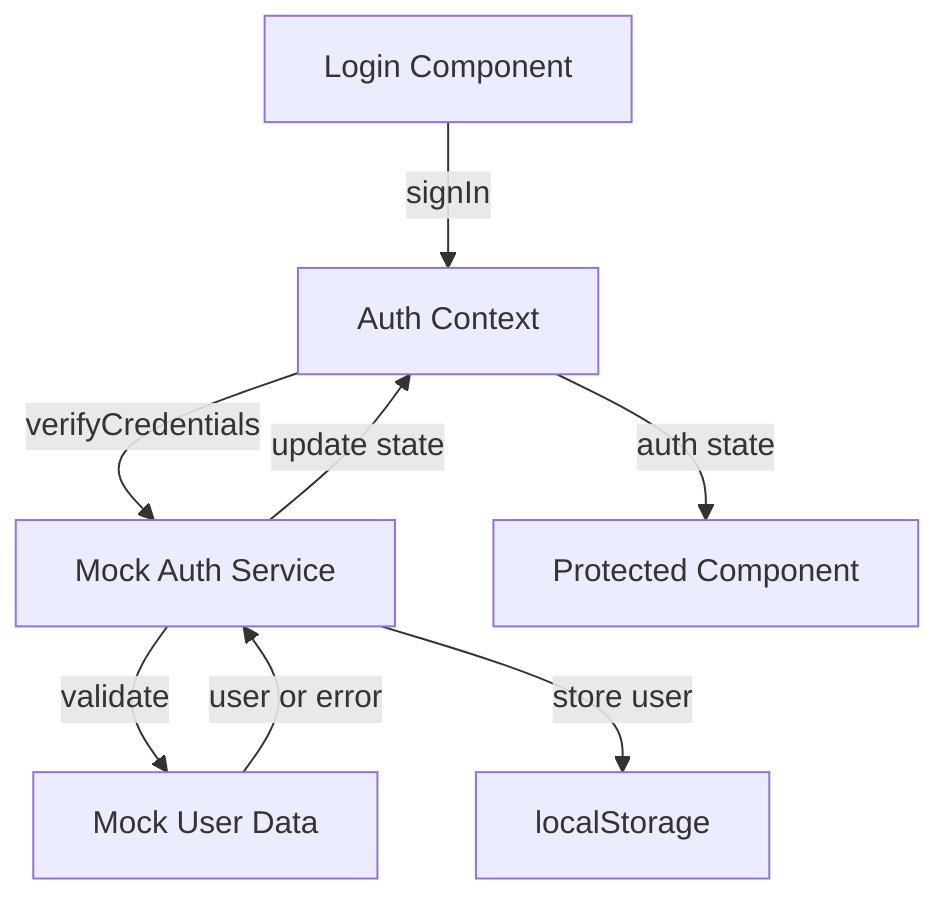

# Wireframe Architecture: Investor-Ready-Wireframe-Conversion

This document outlines the architecture for the investor-ready wireframe implementation, which has been simplified to a wireframe-only approach for more straightforward development and maintenance.

## High-Level Architecture

The wireframe-only architecture simplifies the original application by removing all external dependencies and replacing them with mock implementations:



## Directory Structure

The wireframe implementation uses a dedicated `/lib/mock` directory for all mock implementations:

```
frontend/
├── app/
│   ├── api/
│   │   └── mock/          # Mock API routes
│   │       ├── users/
│   │       ├── events/
│   │       └── equipment/
│   ├── components/
│   │   └── ui/
│   │       └── WireframeIndicator.tsx  # Indicator component
│   └── layout.tsx         # Root layout with indicator
├── lib/
│   ├── mock/              # Mock implementation directory
│   │   ├── config.ts      # Wireframe configuration
│   │   ├── data/          # Mock data definitions
│   │   │   ├── users.ts
│   │   │   ├── events.ts
│   │   │   ├── equipment.ts
│   │   │   └── integrations/
│   │   │       ├── google-drive.ts
│   │   │       ├── google-calendar.ts
│   │   │       └── google-tasks.ts
│   │   ├── services/      # Mock service implementations
│   │   │   ├── mock-auth-service.ts
│   │   │   └── mock-data-service.ts
│   │   └── integrations/  # Mock integration implementations
│   │       ├── mock-integration-manager.ts
│   │       └── adapters/
│   │           ├── mock-google-workspace-adapter.ts
│   │           └── mock-current-rms-adapter.ts
│   └── context/           # Application contexts
│       └── auth-context.tsx  # Simplified auth context
└── middleware-mock.ts     # Simplified middleware
```

## Core Components

### 1. Mock Configuration

The wireframe uses a centralized configuration module with simplified, hardcoded values:

```typescript
// lib/mock/config.ts
export const wireframeConfig = {
  // Always enabled
  enabled: true,
  
  // Default delay for mock operations
  defaultDelay: 300,
  
  // Random failure probability (0-1)
  failureProbability: 0.02,
  
  // Utility functions
  delay: async (ms?: number): Promise<void> => {
    return new Promise(resolve => 
      setTimeout(resolve, ms ?? wireframeConfig.defaultDelay)
    );
  },
  
  // Simulate occasional failures
  maybeFailRandomly: async (): Promise<void> => {
    if (Math.random() < wireframeConfig.failureProbability) {
      throw new Error('Simulated random failure');
    }
  }
};
```

### 2. Mock Data Service

A generic service for CRUD operations on mock data:

```typescript
// lib/mock/services/mock-data-service.ts
export class MockDataService<T extends Entity> {
  private data: T[];
  
  constructor(initialData: T[], entityName: string, delayMs = 300) {
    this.data = [...initialData];
    // ...
  }
  
  // CRUD operations
  async getAll(options): Promise<{ data: T[]; total: number }> { /*...*/ }
  async getById(id: string): Promise<T> { /*...*/ }
  async create(data: Partial<T>): Promise<T> { /*...*/ }
  async update(id: string, data: Partial<T>): Promise<T> { /*...*/ }
  async delete(id: string): Promise<void> { /*...*/ }
  async search(query: string, fields: (keyof T)[]): Promise<T[]> { /*...*/ }
}

// Factory function for creating services
export function createMockDataService<T extends Entity>(
  initialData: T[],
  entityName: string
): MockDataService<T> {
  return new MockDataService<T>(
    initialData,
    entityName,
    wireframeConfig.defaultDelay
  );
}
```

### 3. Mock API Routes

API routes handle HTTP requests and use mock data services:

```typescript
// app/api/mock/[entity]/route.ts
export async function GET(request: NextRequest) {
  // Process request
  // Use mock data service
  // Return response
}

export async function POST(request: NextRequest) {
  // Process request
  // Create with mock data service
  // Return response
}
```

### 4. Mock Auth Provider

A simplified authentication provider using the React Context API:

```typescript
// lib/context/auth-context.tsx
export function AuthProvider({ children }) {
  const [user, setUser] = useState<User | null>(null);
  
  // Initialize from localStorage
  useEffect(() => {
    const storedUser = localStorage.getItem('mockUser');
    if (storedUser) {
      setUser(JSON.parse(storedUser));
    }
  }, []);
  
  // Authentication methods
  const signIn = async () => { /*...*/ };
  const signOut = async () => { /*...*/ };
  
  return (
    <AuthContext.Provider value={{
      user,
      signIn,
      signOut,
      // ...other methods
    }}>
      {children}
    </AuthContext.Provider>
  );
}
```

### 5. Mock Integration Manager

A singleton that manages all mock external service integrations:

```typescript
// lib/mock/integrations/mock-integration-manager.ts
export class MockIntegrationManager {
  private static instance: MockIntegrationManager;
  private adapters: Record<string, any> = {};
  
  private constructor() {
    // Initialize adapters
    this.adapters.googleWorkspace = new MockGoogleWorkspaceAdapter();
    // ...other adapters
  }
  
  public static getInstance(): MockIntegrationManager {
    if (!MockIntegrationManager.instance) {
      MockIntegrationManager.instance = new MockIntegrationManager();
    }
    return MockIntegrationManager.instance;
  }
  
  public getAdapter<T>(name: string): T {
    return this.adapters[name] as T;
  }
}
```

### 6. Middleware

Simplified middleware that always redirects to mock API routes:

```typescript
// middleware-mock.ts
export function middleware(request: NextRequest) {
  const { pathname } = request.nextUrl;
  
  // Check if it's an API request (not to mock API)
  if (pathname.startsWith('/api/') && !pathname.startsWith('/api/mock/')) {
    // Extract the entity path
    const path = pathname.replace('/api/', '');
    
    // Rewrite to mock API
    return NextResponse.rewrite(new URL(`/api/mock/${path}`, request.url));
  }
  
  return NextResponse.next();
}
```

### 7. Wireframe Indicator

A visual indicator showing the application is in wireframe/demo mode:

```tsx
// app/components/ui/WireframeIndicator.tsx
export default function WireframeIndicator() {
  return (
    <div className="fixed bottom-0 left-0 w-full bg-yellow-100 text-yellow-800 py-2 px-4 text-center text-sm z-50 shadow-md">
      <p className="font-medium">
        <span className="inline-block mr-2">💡</span>
        <span>Investor Demo Mode - Using Mock Data</span>
        <span className="inline-block ml-2">💡</span>
      </p>
    </div>
  );
}
```

## Request Flow

The request flow in the wireframe-only implementation is simplified:



## Data Flow

Data flows through the wireframe implementation as follows:



## Key Simplifications

The wireframe-only approach includes several key simplifications:

1. **Direct Import Pattern**: Direct imports of mock services without conditional logic
   ```typescript
   import { mockAuthService } from '@/lib/mock/services/mock-auth-service';
   ```

2. **Hardcoded Configuration**: Configuration values are hardcoded rather than dynamically determined
   ```typescript
   export const wireframeConfig = {
     enabled: true,
     // Other configurations...
   };
   ```

3. **Always-Redirect Middleware**: Middleware always redirects to mock implementations
   ```typescript
   if (isApiRequest) {
     // Always redirect to mock API
     return NextResponse.rewrite(new URL(`/api/mock${path}`, request.url));
   }
   ```

4. **No Dual-Mode Support**: No code for supporting both real and mock modes
   ```typescript
   // Removed conditional logic for dual-mode support
   ```

## Authentication Architecture

Authentication flow is simplified to use localStorage for session persistence:



## Benefits of the Wireframe-Only Architecture

1. **Simplified Implementation**: Easier to understand, develop, and maintain
2. **Consistent Behavior**: Predictable behavior without external dependencies
3. **Improved Performance**: No external API calls or authentication delays
4. **Complete Control**: Fine-grained control over all aspects of the application
5. **Focused Purpose**: Optimized specifically for investor demonstrations

## Limitations

1. **Not Production-Ready**: The wireframe implementation is not suitable for production use
2. **Limited Functionality**: Some complex interactions may be simplified
3. **Static Data**: Data changes don't persist across sessions (unless manually saved to localStorage)

## Extension Points

While the current implementation focuses on core functionality, the architecture can be extended:

1. **Additional Mock Services**: Add more mock services for new features
2. **Enhanced Visualization**: Add more visual indicators for mockups of future features
3. **Persistent State**: Add localStorage persistence for more state if needed
4. **MockQL Layer**: Add a GraphQL mock layer to simulate rich data querying

## Conclusion

The wireframe-only architecture provides a clean, maintainable implementation for investor demonstrations. By removing the complexity of supporting both real and mock modes, the codebase is simpler and more focused on its specific purpose.
