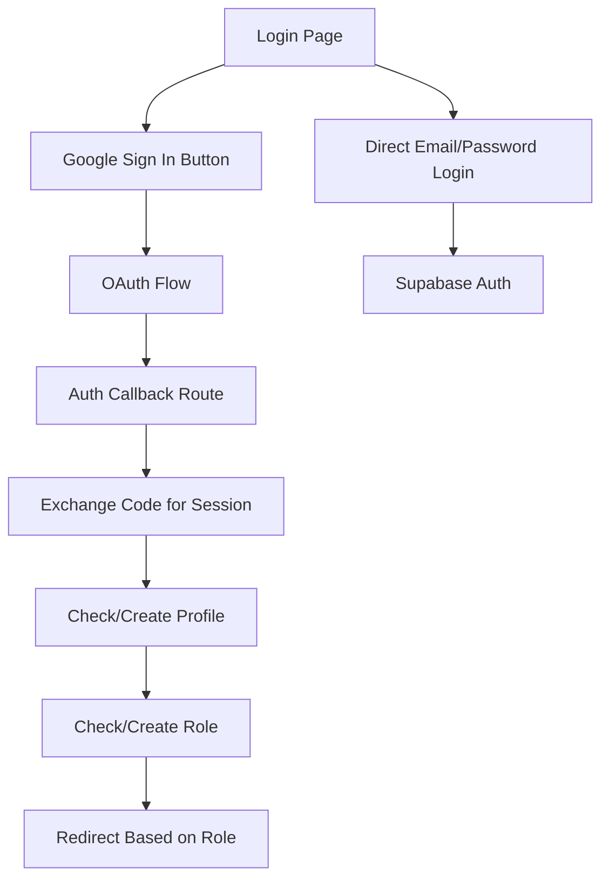

# Current Authentication Flow Implementation

This document details the current implementation of authentication in the FOHP application, highlighting the structure, components, and key issues that the refactoring aims to address.

## Overall Architecture

The current authentication implementation is distributed across multiple components without a centralized service:



## Key Components

### 1. Login Page (`/app/auth/login/page.tsx`)

- Client-side component handling login UI
- Uses direct Supabase client for login operations
- Implements email/password authentication
- Integrates Google sign-in button component
- Contains local error state management
- Handles redirect to dashboard after login

```typescript
const handleLogin = async (e: React.FormEvent) => {
  e.preventDefault()
  setLoading(true)
  setError(null)
  
  try {
    const supabase = createClient()
    const { error } = await supabase.auth.signInWithPassword({
      email,
      password,
    })
    
    if (error) throw error
    
    // Refresh the page to update auth state
    router.push('/dashboard')
    router.refresh()
  } catch (error: any) {
    setError(error?.message || 'Error logging in')
  } finally {
    setLoading(false)
  }
}
```

### 2. Google Sign-In Button (`/app/components/ui/GoogleSignInButton.tsx`)

- Client-side component for Google OAuth
- Uses direct Supabase client for OAuth operations
- Handles Google sign-in UI and click events
- Redirects user to Google for authentication
- Sets callback URL for post-authentication redirect
- Contains local error handling

```typescript
const handleGoogleSignIn = async () => {
  setLoading(true)
  try {
    const supabase = createClient()
    const { error } = await supabase.auth.signInWithOAuth({
      provider: 'google',
      options: {
        redirectTo: `${window.location.origin}/auth/callback`,
      },
    })
    
    if (error) throw error
    
    // The user will be redirected to Google's login page, and then back to our callback URL
  } catch (error: any) {
    console.error('Error signing in with Google:', error.message)
    alert('Error signing in with Google. Please try again.')
  } finally {
    setLoading(false)
  }
}
```

### 3. Auth Callback Route (`/app/auth/callback/route.ts`)

- Server-side route handling OAuth callback
- Extremely complex implementation (~500 lines)
- Contains multiple nested try-catch blocks
- Handles code exchange for session
- Implements profile creation with multiple fallbacks
- Handles role assignment and verification
- Manages user redirect based on role
- Contains extensive error handling and recovery logic

Key sections include:

1. **Code Exchange:**
```typescript
// Exchange the code for a session
const { error: sessionError } = await supabase.auth.exchangeCodeForSession(code)
```

2. **Profile Creation:** (With multiple fallbacks)
```typescript
// Check if user has a profile
const { data: profile, error: profileError } = await supabase
  .from('profiles')
  .select('*')
  .eq('id', user.id)
  .single()

// If no profile exists, we need to create one
if (profileError) {
  // Try RPC functions first
  // Fallback to direct insertion
  // Multiple emergency fallbacks
}
```

3. **Role Management:**
```typescript
// Get user role from the user_roles table
const { data: userRoleData, error: roleError } = await supabase
  .from('user_roles')
  .select('role, is_approved')
  .eq('user_id', user.id)
  .single()

// Create role if needed
// Verify approval status
```

4. **Role-Based Redirect:**
```typescript
// Redirect based on user role
if (userRole.role === 'manager' && userRole.is_approved) {
  return NextResponse.redirect(new URL('/dashboard/manager', request.url))
} else if ((userRole.role === 'employee' || userRole.role === 'manager') && userRole.is_approved) {
  return NextResponse.redirect(new URL('/dashboard/employee', request.url))
} else if (userRole.role === 'customer') {
  // Default to customer portal for customer role
  return NextResponse.redirect(new URL('/dashboard/customer', request.url))
} else if (!userRole.is_approved) {
  // Show a specific message for unapproved accounts
  return NextResponse.redirect(new URL('/auth/login?error=account_pending_approval', request.url))
}
```

## Authentication Flows

### Email/Password Authentication Flow

1. User enters email and password on login page
2. Login page calls Supabase `signInWithPassword` directly
3. On success, user is redirected to dashboard
4. Dashboard pages handle role-based access control
5. Error handling is managed locally in the login component

### Google OAuth Authentication Flow

1. User clicks "Sign in with Google" button
2. Button component calls Supabase `signInWithOAuth` directly
3. User is redirected to Google for authentication
4. Google redirects back to `/auth/callback` with auth code
5. Callback route exchanges code for session
6. Callback route checks/creates user profile (with multiple fallback mechanisms)
7. Callback route checks/creates user role
8. User is redirected to appropriate dashboard based on role
9. Error handling is distributed across multiple components and the callback route

## Database Interactions

### Profile Management

- Profiles are stored in the `profiles` table
- Profile creation happens on first login
- Multiple fallback mechanisms for profile creation:
  1. RPC function `ensure_user_has_profile_and_role`
  2. RPC function `emergency_create_profile` 
  3. Direct database insertion
  4. RPC function `fix_user_with_missing_email`

### Role Management

- Roles are stored in the `user_roles` table
- Default role is 'customer'
- Roles can be 'customer', 'employee', or 'manager'
- Roles have an approval status (`is_approved` boolean)

## Error Handling

The current implementation employs a complex error handling approach:

1. **Extensive Try-Catch Nesting:** Multiple levels of try-catch blocks
2. **Multiple Recovery Mechanisms:** Several fallback approaches for failures
3. **Detailed Logging:** Verbose console logging throughout the flow
4. **Specific Error Redirects:** Different redirect URLs based on error types
5. **Client-Side Error Display:** Error state management in UI components

Example error redirect:
```typescript
return NextResponse.redirect(
  new URL(`/auth/login?error=${errorCode}&message=${encodeURIComponent(errorMessage)}`, 
  request.url)
);
```

## Known Issues

1. **Callback Route Complexity:** The callback route is excessively long (~500 lines) and complex with deeply nested logic.

2. **Duplicated Logic:** Authentication logic is duplicated across components.

3. **Multiple Fallback Mechanisms:** The implementation uses numerous fallback mechanisms that make the logic difficult to follow.

4. **Direct Database Access:** UI components directly access the database, violating separation of concerns.

5. **Inconsistent Error Handling:** Error handling is inconsistent across components.

6. **Complex Profile Creation Logic:** The profile creation logic has multiple nested fallbacks and emergency procedures.

7. **Tightly Coupled Components:** UI and authentication logic are tightly coupled.

8. **Limited Type Safety:** Minimal TypeScript type definitions for auth operations.

9. **Poor Testability:** Complex implementation makes testing difficult.

10. **Recovery Code:** Significant portion of code is dedicated to handling edge cases and recovery from specific failure modes.

## Google Auth Specific Challenges

The current implementation deals with several Google authentication challenges:

1. **Email Validation:** Handling null or empty email fields from Google auth
2. **Profile Creation Errors:** Fallback mechanisms for profile creation failures
3. **Database Constraints:** Workarounds for SQL constraints on the profiles table
4. **Parameter Naming Inconsistencies:** Switching between `user_id` and `user_uuid` in RPC calls
5. **Google Metadata Handling:** Extraction of profile data from Google user metadata

## Conclusion

The current authentication implementation is functional but suffers from significant maintainability and complexity issues. The refactoring will address these issues by centralizing authentication logic, improving type safety, and simplifying the callback route implementation.
