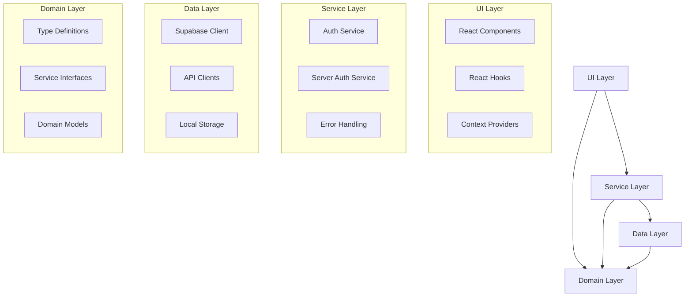

# Auth Flow Relevant Patterns

This document outlines the key architectural patterns and design considerations relevant to the authentication flow refactoring.

## Authentication Patterns

### 1. Clean Architecture

The refactoring will implement Clean Architecture principles to separate concerns:



Key benefits of this architecture:

- **Separation of Concerns**: Each layer has a distinct responsibility
- **Testability**: Each component can be tested in isolation
- **Maintainability**: Changes in one layer don't affect others
- **Flexibility**: Implementation details can change without affecting other parts

### 2. Repository Pattern

The authentication service will act as a repository, abstracting data access:

```typescript
// Repository Interface
interface IAuthRepository {
  signInWithEmail(email: string, password: string): Promise<AuthResult<User>>;
  signInWithOAuth(provider: AuthProvider): Promise<AuthResult>;
  getCurrentUser(): Promise<AuthResult<User>>;
  // Additional methods...
}

// Concrete Implementation
class SupabaseAuthRepository implements IAuthRepository {
  async signInWithEmail(email: string, password: string): Promise<AuthResult<User>> {
    // Implementation using Supabase
  }
  
  // Additional method implementations...
}
```

This pattern:
- Abstracts the data source implementation
- Facilitates mocking for tests
- Enables potential future provider changes

### 3. Singleton Pattern

The auth service will be implemented as a singleton to ensure consistent state:

```typescript
// Private constructor
class AuthService implements IAuthService {
  private static instance: AuthService;
  
  private constructor() {
    // Initialization
  }
  
  public static getInstance(): AuthService {
    if (!AuthService.instance) {
      AuthService.instance = new AuthService();
    }
    return AuthService.instance;
  }
  
  // Service methods...
}

// Export singleton instance
export const authService = AuthService.getInstance();
```

Benefits:
- Single source of truth for auth state
- Consistent behavior across the application
- Efficient resource usage

### 4. Adapter Pattern

The refactoring will use an adapter pattern to normalize Supabase-specific types to our domain types:

```typescript
// Adapter function to convert Supabase user to domain User
function adaptSupabaseUser(supabaseUser: any): AuthUser {
  return {
    id: supabaseUser.id,
    email: supabaseUser.email,
    provider: supabaseUser.app_metadata?.provider,
    user_metadata: supabaseUser.user_metadata,
    app_metadata: supabaseUser.app_metadata
  };
}
```

This pattern:
- Decouples domain models from external service specifics
- Makes the system more resilient to API changes
- Simplifies testing by providing a clear seam for mocking

### 5. Provider Pattern

For React integration, the auth flow will use the Provider pattern:

```typescript
// Auth Context & Provider
export const AuthContext = createContext<AuthContextType>({ /* default values */ });

export const AuthProvider = ({ children }: { children: React.ReactNode }) => {
  // State and logic...
  
  return (
    <AuthContext.Provider value={/* context value */}>
      {children}
    </AuthContext.Provider>
  );
};

// Hook for consumers
export const useAuth = () => useContext(AuthContext);
```

Benefits:
- Decouples authentication state from UI components
- Makes auth state and operations available throughout the component tree
- Simplifies testing by allowing context mocking

### 6. Result Pattern

All auth operations will return a standardized result object:

```typescript
// Result type definition
export interface AuthResult<T = void> {
  data: T | null;
  error: AuthError | null;
  success: boolean;
}

// Usage example
async function signIn(): Promise<AuthResult<User>> {
  try {
    // Authentication logic
    return {
      data: user,
      error: null,
      success: true
    };
  } catch (error) {
    return {
      data: null,
      error: mapError(error),
      success: false
    };
  }
}
```

This pattern:
- Provides consistent error handling
- Eliminates the need for try/catch blocks in consuming code
- Makes success and error states explicit
- Facilitates type safety for operation results

## Error Handling Patterns

### 1. Centralized Error Handling

The refactoring will implement centralized error handling:

```typescript
// Error handler function
export function handleAuthError(error: any, operation: string): AuthResult {
  // Log error for debugging
  console.error(`Auth error in ${operation}:`, error);
  
  // Convert to standard format
  const authError: AuthError = {
    code: error.code || 'unknown',
    message: error.message || 'An unknown error occurred',
    details: error
  };
  
  // Return standardized result
  return {
    data: null,
    error: authError,
    success: false
  };
}
```

Benefits:
- Consistent error handling across all auth operations
- Centralized logging and monitoring
- Standardized error format for UI display

### 2. Error Classification

Errors will be classified by type to enable appropriate handling:

```typescript
// Error classification
function classifyError(error: any): ErrorType {
  if (error.code === 'auth/invalid-email' || error.code === 'auth/wrong-password') {
    return ErrorType.VALIDATION;
  }
  
  if (error.code === 'auth/network-request-failed') {
    return ErrorType.NETWORK;
  }
  
  if (error.code === 'auth/user-disabled' || error.code === 'auth/user-not-found') {
    return ErrorType.USER_NOT_FOUND;
  }
  
  return ErrorType.UNKNOWN;
}
```

This pattern:
- Enables context-specific error handling
- Facilitates appropriate UI feedback
- Simplifies error recovery strategies

## State Management Patterns

### 1. React Context for Auth State

Auth state will be managed in React context:

```typescript
interface AuthState {
  user: User | null;
  isLoading: boolean;
  isAuthenticated: boolean;
  error: AuthError | null;
}

// Context management in provider
export const AuthProvider = ({ children }: { children: React.ReactNode }) => {
  const [authState, setAuthState] = useState<AuthState>({
    user: null,
    isLoading: true,
    isAuthenticated: false,
    error: null
  });
  
  // Methods to update state...
  
  return (
    <AuthContext.Provider value={{ ...authState, ...authMethods }}>
      {children}
    </AuthContext.Provider>
  );
};
```

Benefits:
- Single source of truth for auth state
- Reactive updates to auth changes
- Simplified state access in components

### 2. Immutable State Updates

State updates will follow immutability principles:

```typescript
// Immutable state update
function updateUser(user: User) {
  setAuthState(prevState => ({
    ...prevState,
    user,
    isAuthenticated: !!user
  }));
}
```

This pattern:
- Prevents state mutation bugs
- Facilitates debugging
- Enables consistent component rendering

## Security Patterns

### 1. Backend Authentication Validation

Critical auth operations will be validated on the server side:

```typescript
// Server-side validation
export async function GET(request: NextRequest) {
  // Validate the authentication code
  const code = url.searchParams.get('code');
  if (!code) {
    return NextResponse.redirect('/auth/login?error=missing_auth_code');
  }
  
  // Process authentication securely on the server
  // ...
}
```

This pattern:
- Prevents client-side manipulation
- Secures sensitive operations
- Enables proper session management

### 2. Token Management

Authentication tokens will be securely managed:

```typescript
// Secure token handling
const { data, error } = await supabase.auth.signInWithPassword({
  email,
  password,
});

// Tokens are automatically managed by Supabase client in cookies
// No manual token handling required
```

Benefits:
- Secure token storage in HTTP-only cookies
- Automatic token refresh handling
- Protection against XSS attacks

## Testing Patterns

### 1. Repository Mocking

The auth repository will be designed for easy mocking:

```typescript
// Mock repository for testing
const mockAuthRepository: IAuthRepository = {
  signInWithEmail: jest.fn(),
  signInWithOAuth: jest.fn(),
  getCurrentUser: jest.fn(),
  // Additional methods...
};

// Test using mock
describe('Auth Service', () => {
  it('should handle sign in success', async () => {
    mockAuthRepository.signInWithEmail.mockResolvedValueOnce({
      data: { id: 'user-123' },
      error: null,
      success: true
    });
    
    // Test using mock repository
  });
});
```

This pattern:
- Isolates tests from external dependencies
- Enables testing edge cases and error scenarios
- Improves test reliability and performance

### 2. Component Testing with Providers

UI components will be tested with mocked auth providers:

```typescript
// Test component with mocked auth context
it('should display user email when authenticated', () => {
  render(
    <AuthContext.Provider value={{
      user: { id: 'user-123', email: 'test@example.com' },
      isAuthenticated: true,
      isLoading: false,
      error: null,
      // Other required values...
    }}>
      <UserProfile />
    </AuthContext.Provider>
  );
  
  expect(screen.getByText('test@example.com')).toBeInTheDocument();
});
```

Benefits:
- Tests components in isolation
- Controls the auth state for different scenarios
- Simplifies testing authenticated and unauthenticated states

## Conclusion

The auth flow refactoring will implement these architectural patterns to create a robust, maintainable, and secure authentication system. By following these established patterns, we will ensure a clean separation of concerns, improved testability, and a more maintainable codebase.
