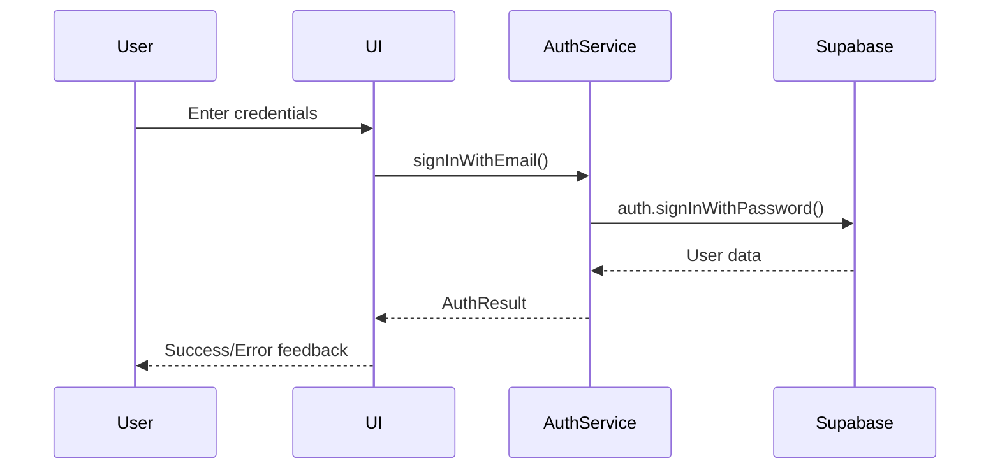

# Auth Flow Refactoring - Best Practices & Security Considerations

This document outlines the key best practices, security considerations, and guidelines to follow during the authentication flow refactoring.

## Code Quality Guidelines

### 1. TypeScript Usage

- **Use Strict Types**: Always use explicit types rather than `any`
- **Avoid Type Assertions**: Use proper type guards instead of type assertions when possible
- **Leverage Generics**: Use generics for flexible, type-safe functions
- **Define Interfaces**: Create interfaces for all domain objects
- **Use Discriminated Unions**: For type narrowing in conditionals

```typescript
// Good practice
interface AuthResult<T = void> {
  data: T | null;
  error: AuthError | null;
  success: boolean;
}

// Avoid
const handleAuth = (result: any) => {
  // Type-unsafe code
};
```

### 2. Asynchronous Code

- **Use async/await**: Prefer async/await over Promise chains
- **Proper Error Handling**: Always catch promises appropriately
- **Avoid Nested Promises**: Use Promise.all for parallel operations
- **Clear Return Types**: Specify return types for async functions
- **Avoid Sync/Async Mix**: Don't mix synchronous and asynchronous code patterns

```typescript
// Good practice
async function getUser(userId: string): Promise<AuthResult<User>> {
  try {
    const response = await api.getUser(userId);
    return { data: response, error: null, success: true };
  } catch (error) {
    return handleError(error, 'get-user');
  }
}

// Avoid
function getUser(userId) {
  return api.getUser(userId)
    .then(response => ({ data: response }))
    .catch(error => console.error(error));
}
```

### 3. Code Organization

- **Group Related Functionality**: Keep related functionality in the same file/module
- **Small, Focused Functions**: Each function should do one thing well
- **Max Function Length**: Aim for functions under 50 lines
- **Descriptive Naming**: Use clear, descriptive names for functions and variables
- **Consistent Formatting**: Follow consistent code style (use ESLint/Prettier)

```typescript
// Good organization
// auth-service.ts - Authentication operations
// user-service.ts - User profile operations
// role-service.ts - Role management operations

// Avoid
// auth.ts - Mixed authentication, profile, and role operations
```

### 4. Error Handling

- **Centralized Error Handling**: Use centralized error handling utilities
- **Consistent Error Format**: Standardize error format across the application
- **Descriptive Error Messages**: Use clear error messages with actionable information
- **Error Categorization**: Categorize errors by type for appropriate handling
- **Avoid Swallowing Errors**: Always handle or propagate errors

```typescript
// Good practice
export function handleAuthError(error: any, operation: string): AuthResult {
  console.error(`Auth error in ${operation}:`, error);
  
  return {
    data: null,
    error: {
      code: error.code || 'unknown',
      message: error.message || 'An unknown error occurred',
      details: error
    },
    success: false
  };
}

// Avoid
try {
  // Operation
} catch (error) {
  console.log('Error');
  // Error swallowed with no proper handling
}
```

## Authentication Best Practices

### 1. Token Handling

- **Use HTTP-Only Cookies**: Store tokens in HTTP-only cookies, not localStorage
- **Automatic Token Refresh**: Implement token refresh mechanism
- **Token Validation**: Validate tokens on the server side
- **Secure Token Transmission**: Only transmit tokens over HTTPS
- **Token Expiration**: Set appropriate token expiration times

```typescript
// Good practice - using Supabase's built-in secure token handling
const { data, error } = await supabase.auth.signInWithPassword({
  email,
  password,
});

// Avoid - manual token storage in localStorage
localStorage.setItem('auth_token', token);
```

### 2. Session Management

- **Single Sign-On Considerations**: Support for multiple authentication providers
- **Session Timeout**: Implement appropriate session timeouts
- **Session Invalidation**: Properly invalidate sessions on logout
- **Session Storage**: Store minimal session data, never sensitive information
- **Device Management**: Consider support for multiple devices/sessions

```typescript
// Good practice
async function signOut(): Promise<AuthResult> {
  try {
    await supabase.auth.signOut();
    // Clear any application state
    return { data: null, error: null, success: true };
  } catch (error) {
    return handleError(error, 'sign-out');
  }
}
```

### 3. User Authentication

- **Multi-Factor Authentication**: Design with MFA support in mind
- **Password Policies**: Follow NIST guidelines for password management
- **Account Recovery**: Implement secure account recovery mechanisms
- **Secure Defaults**: Use secure defaults for authentication settings
- **Progressive Enhancement**: Layer security features appropriately

```typescript
// Good practice - support for multiple auth methods
export type AuthProvider = 'email' | 'google' | 'phone';

async function signInWithProvider(provider: AuthProvider, credentials: any): Promise<AuthResult<User>> {
  // Provider-specific authentication logic
}
```

### 4. Role-Based Access Control

- **Role Validation**: Validate roles on the server side
- **Principle of Least Privilege**: Assign minimal necessary permissions
- **Role Hierarchy**: Implement clear role hierarchy if needed
- **Role Separation**: Separate authentication from authorization
- **Dynamic Permissions**: Consider support for dynamic permissions

```typescript
// Good practice
async function hasPermission(user: User, permission: Permission): Promise<boolean> {
  // Server-side permission validation
  const { data, error } = await supabase
    .rpc('has_permission', { user_id: user.id, permission });
    
  return data === true;
}
```

## Security Considerations

### 1. Input Validation

- **Sanitize All User Input**: Validate and sanitize all user inputs
- **Type Validation**: Validate data types for all inputs
- **Server-Side Validation**: Always validate on the server side
- **Input Length Limits**: Set appropriate length limits for inputs
- **Validate Unexpected Inputs**: Handle unexpected inputs gracefully

```typescript
// Good practice - validation before use
function validateEmail(email: string): boolean {
  const emailRegex = /^[a-zA-Z0-9._%+-]+@[a-zA-Z0-9.-]+\.[a-zA-Z]{2,}$/;
  return emailRegex.test(email);
}

// Server-side validation is also crucial
```

### 2. Authentication Security

- **Brute Force Protection**: Implement rate limiting for authentication attempts
- **Secure Password Handling**: Use appropriate hashing (handled by Supabase)
- **OAuth Security**: Follow OAuth security best practices
- **Credential Transmission**: Only transmit credentials over HTTPS
- **Secure Error Messages**: Avoid revealing sensitive information in error messages

```typescript
// Good practice - generic error messages
function getLoginErrorMessage(error: AuthError): string {
  // Return generic error for authentication failures
  if (error.code === 'invalid_credentials') {
    return 'Invalid email or password';
  }
  
  // More specific for non-sensitive errors
  if (error.code === 'network_error') {
    return 'Connection problem. Please try again.';
  }
  
  return 'An error occurred during login. Please try again.';
}
```

### 3. Data Protection

- **Minimize Data Collection**: Only collect necessary user data
- **Secure Data Transmission**: Use HTTPS for all data transmission
- **Data Encryption**: Encrypt sensitive data at rest
- **Data Access Control**: Implement proper access controls for user data
- **Data Retention**: Follow appropriate data retention policies

```typescript
// Good practice - minimal profile data
interface UserProfile {
  id: string;
  email: string;
  full_name?: string;
  avatar_url?: string;
  // Only necessary fields
}
```

### 4. OWASP Top 10 Awareness

- **Cross-Site Scripting (XSS)**: Sanitize outputs, use CSP
- **Cross-Site Request Forgery (CSRF)**: Use anti-CSRF tokens
- **Injection Attacks**: Parameterize queries, validate inputs
- **Broken Authentication**: Follow authentication best practices
- **Security Misconfiguration**: Use secure defaults

```typescript
// Good practice - parameterized queries (handled by Supabase)
const { data } = await supabase
  .from('profiles')
  .select('*')
  .eq('id', userId);

// Avoid string concatenation in queries or API paths
```

## Performance Considerations

### 1. Lazy Loading

- **Lazy Load Authentication Components**: Load auth components only when needed
- **Code Splitting**: Split authentication code for efficient loading
- **Minimal Dependencies**: Keep authentication dependencies minimal
- **Optimized Imports**: Use specific imports, not entire libraries
- **Efficient State Management**: Minimize unnecessary re-renders

```typescript
// Good practice
import { signInWithPassword } from '@/lib/auth/email-auth';

// Avoid
import * as Auth from '@/lib/auth';
```

### 2. Caching

- **Cache User Data**: Cache user data appropriately
- **Cache Invalidation**: Properly invalidate cache on auth state changes
- **Session Reuse**: Reuse session information when appropriate
- **Minimize API Calls**: Avoid redundant authentication API calls
- **Efficient State Updates**: Update only what has changed

```typescript
// Good practice - only update what changed
function updateUser(newData: Partial<User>) {
  setAuthState(prevState => ({
    ...prevState,
    user: { ...prevState.user, ...newData }
  }));
}
```

### 3. Background Operations

- **Asynchronous Token Refresh**: Refresh tokens in the background
- **Prefetch User Data**: Prefetch relevant user data after authentication
- **Parallel Operations**: Run independent operations in parallel
- **Optimistic Updates**: Use optimistic updates for better UX
- **Debounce Operations**: Debounce frequent authentication checks

```typescript
// Good practice - parallel operations
async function getUserDetails(userId: string): Promise<UserDetails> {
  const [profile, roles, settings] = await Promise.all([
    userService.getProfile(userId),
    roleService.getUserRoles(userId),
    settingsService.getUserSettings(userId)
  ]);
  
  return { profile, roles, settings };
}
```

## Testing Guidelines

### 1. Test Coverage

- **Unit Test Services**: Test all authentication service methods
- **Test Error Cases**: Test error handling and edge cases
- **Test Authentication Flows**: Test complete authentication flows
- **Mock External Dependencies**: Mock Supabase and other external services
- **Verify Security**: Test security implementations

```typescript
// Good practice
describe('AuthService', () => {
  it('should handle authentication errors', async () => {
    // Arrange
    mockSupabase.auth.signInWithPassword.mockResolvedValueOnce({
      data: null,
      error: { message: 'Invalid credentials', code: 'invalid_credentials' }
    });
    
    // Act
    const result = await authService.signInWithEmail('test@example.com', 'wrong-password');
    
    // Assert
    expect(result.success).toBe(false);
    expect(result.error).toBeDefined();
    expect(result.error?.code).toBe('invalid_credentials');
  });
});
```

### 2. Test Organization

- **Separate Test Types**: Organize tests by type (unit, integration, etc.)
- **Test Naming Convention**: Use clear, descriptive test names
- **Arrange-Act-Assert Pattern**: Follow AAA pattern in tests
- **Test Isolation**: Ensure tests are isolated and don't affect each other
- **Clean Up**: Clean up test artifacts appropriately

```typescript
// Good practice
it('should sign in user with valid credentials', async () => {
  // Arrange - setup test data
  const mockUser = { id: 'test-id', email: 'test@example.com' };
  mockSupabase.auth.signInWithPassword.mockResolvedValueOnce({
    data: { user: mockUser },
    error: null
  });
  
  // Act - perform the action being tested
  const result = await authService.signInWithEmail('test@example.com', 'password');
  
  // Assert - verify the results
  expect(result.success).toBe(true);
  expect(result.data).toEqual(expect.objectContaining({
    auth: expect.objectContaining({ id: 'test-id' })
  }));
});
```

## Accessibility & User Experience

### 1. Authentication Forms

- **Form Accessibility**: Ensure authentication forms are accessible
- **Error Messages**: Display clear, accessible error messages
- **Loading States**: Show appropriate loading states during authentication
- **Keyboard Navigation**: Support keyboard navigation in auth flows
- **Screen Reader Support**: Ensure screen reader compatibility

```typescript
// Good practice
function LoginForm() {
  const [isLoading, setIsLoading] = useState(false);
  
  return (
    <form onSubmit={handleSubmit}>
      <label htmlFor="email">Email</label>
      <input
        id="email"
        type="email"
        aria-describedby="email-error"
        required
      />
      {errors.email && (
        <p id="email-error" className="error" role="alert">
          {errors.email}
        </p>
      )}
      
      <button 
        type="submit" 
        disabled={isLoading}
        aria-busy={isLoading}
      >
        {isLoading ? 'Signing in...' : 'Sign in'}
      </button>
    </form>
  );
}
```

### 2. Authentication Flows

- **Minimize Steps**: Keep authentication flows as simple as possible
- **Clear Guidance**: Provide clear instructions at each step
- **Remember User Choices**: Remember user preferences where appropriate
- **Seamless Transitions**: Create smooth transitions between auth steps
- **Progressive Enhancement**: Ensure basic functionality works without JS

```typescript
// Good practice - clear, stepwise UI guidance
function AuthFlow() {
  const { step } = useAuthFlow();
  
  return (
    <div>
      <AuthStepIndicator currentStep={step} totalSteps={3} />
      
      {step === 1 && <CredentialsForm />}
      {step === 2 && <ProfileSetup />}
      {step === 3 && <SuccessScreen />}
      
      <AuthHelpSection step={step} />
    </div>
  );
}
```

## Documentation Guidelines

### 1. Code Documentation

- **Document Public APIs**: Document all public service methods
- **Document Type Definitions**: Include descriptions for type definitions
- **Example Usage**: Provide example usage where appropriate
- **Error Documentation**: Document possible errors and their meaning
- **Security Notes**: Include security considerations in documentation

```typescript
/**
 * Signs in a user with email and password
 * 
 * @param email - The user's email address
 * @param password - The user's password
 * @returns An AuthResult containing the user data or error
 * 
 * @example
 * const result = await authService.signInWithEmail('user@example.com', 'password');
 * if (result.success) {
 *   console.log('Signed in user:', result.data);
 * }
 */
async signInWithEmail(email: string, password: string): Promise<AuthResult<User>>
```

### 2. Implementation Documentation

- **Architecture Overview**: Document the overall auth architecture
- **Flow Diagrams**: Include flow diagrams for authentication processes
- **Decision Documentation**: Document key decisions and their rationale
- **Security Model**: Document the security model and assumptions
- **Extension Points**: Document how to extend the authentication system

```markdown
# Authentication Architecture

## Overview

The authentication system uses a layered architecture:

1. **UI Layer** - React components and hooks
2. **Service Layer** - Auth service and related services
3. **Data Layer** - Supabase integration and caching

## Authentication Flow


```

## Conclusion

These guidelines and best practices should be followed throughout the authentication flow refactoring to ensure a secure, maintainable, and high-quality implementation. Adhering to these practices will help create a robust authentication system that can be extended and maintained over time.
